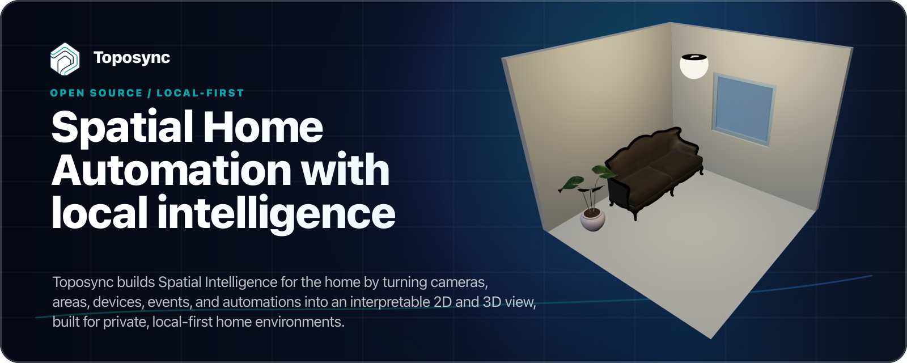

<p align="center">
  <a href="https://toposync.com/">
    
  </a>
</p>

# Toposync

[Português (Brasil)](README.pt-BR.md)

**Toposync** is an **alpha-stage, open source, local-first platform** for **Spatial Home Automation with local intelligence**: camera intelligence, spatial camera mapping, spatial events, and 2D/3D home visualization for private home environments, optionally integrated with Home Assistant.

The goal is to turn a smart home into a visual and interpretable environment: cameras, areas, devices, automations, notifications, and events can exist inside a 2D/3D map of the home.

The category Toposync is exploring is **Spatial Home Automation**. In practical terms:

- **Spatial Camera Mapping** connects camera images to real positions, areas, and views inside the home model.
- **Spatial Events** are camera or automation events with position, area, camera, object state, and context.
- **Spatial Intelligence** is the broader local interpretation layer that can combine cameras, areas, devices, pipelines, and history.
- **Spatial Awareness** is feature language for area-aware behavior, such as reacting differently near a gate, pool, driveway, sidewalk, or entrance.

> Toposync is currently in **alpha early access**. It can already be tested by early adopters, advanced home automation users, Home Assistant users, IP camera users, RTSP/ONVIF users, homelab enthusiasts, and people interested in local computer vision.

> **Important notice:** Toposync can provide additional layers of visualization, automation, and situational awareness, but it does **not** replace certified security systems, dedicated sensors, human supervision, or protective equipment. Do not rely on it yet for safety-critical automation, unattended security monitoring, emergency workflows, access control, or any automation where failure could cause harm, property damage, privacy exposure, or loss of essential service.

## Alpha early access

This stage is primarily about **bug hunting, integration validation, and real-world testing**.

There are many possible combinations of cameras, devices, brands, protocols, networks, GPUs, operating systems, Home Assistant installations, browsers, apps, and streaming modes. Community testing is essential to validate all of this.

You can help by:

- testing Toposync in different contained environments, while following the safety guidance in [SECURITY.md](SECURITY.md);
- opening issues for bugs you find;
- sharing sanitized logs, camera models, protocols, and usage scenarios;
- suggesting UX, documentation, and installation improvements;
- validating Home Assistant, RTSP, ONVIF, PTZ, streaming, and hardware integrations;
- contributing code, documentation, pipelines, and examples;
- preparing future third-party extensions;
- supporting development through [GitHub Sponsors](https://github.com/sponsors/mateuscalza).

> **Security issues:** do not publish vulnerability details in public issues. Follow [SECURITY.md](SECURITY.md) and use private GitHub vulnerability reporting or a private GitHub Security Advisory when available.

## What can you build with Toposync?

| Use case | What it enables | Status |
| --- | --- | --- |
| **2D/3D home view** | Visualize your home, rooms, areas, devices, cameras, and entities in a spatial model. | **Ready for testing** |
| **Spatial Home Automation** | See lights, cameras, sensors, and devices inside the home representation, with visual states such as active lights, selected entities, or active items. | **Ready for testing** |
| **Spatial Events** | Turn camera detections into events positioned in real areas of the home. Instead of only knowing that something was detected, see where it happened. | **Ready for testing** |
| **Spatial tracking** | Track objects, people, or events over time and associate their paths with areas of the home. | **Ready for testing** |
| **Spatial Awareness at entrances** | Detect people, vehicles, or deliveries stopped near the gate, driveway, sidewalk, or entrance. | **Ready for testing** |
| **Relevant stopped objects** | Create rules for things that actually stopped in an area, instead of reacting to every fast movement. | **Ready for testing** |
| **Spatial Awareness for sensitive areas** | Add an extra awareness layer around places such as pools, gates, garages, backyards, or restricted areas. | **Ready for testing** |
| **Pets near sensitive areas** | Combine detection, areas, and notifications to notice relevant situations involving pets near places such as pools, streets, or gates. | **Ready for testing** |
| **Spatial 360 view** | Project camera images into the 2D/3D model, creating a visualization inspired by car 360 camera systems. | **Early experiment** |
| **Multi-brand cameras** | Bring RTSP/ONVIF cameras from different brands into a single local interface. | **Ready for testing** |
| **Centralized local AI** | Run models and pipelines on a local machine such as a mini PC, server, NAS, or GPU desktop. | **Ready for testing** |
| **Idle hardware as an AI server** | Use an existing machine to process cameras and automations when it is available. | **Ready for testing** |
| **Common cameras with local intelligence** | Use simple cameras as image sources and concentrate intelligence in a more flexible local platform. | **Ready for testing** |
| **Detection beyond the camera** | Use more advanced models and pipelines than the built-in AI of each camera, including distant objects or specific visual conditions. | **Ready for testing, advanced** |
| **Local AI pipelines** | Combine camera input, detection, tracking, filters, areas, notifications, and actions in customizable flows. | **Ready for testing** |
| **Spatial rules by area** | The same detection can mean different things depending on the area. A person on the sidewalk may be normal; the same person in the backyard at another time may trigger an alert. | **Ready for testing** |
| **Context-aware notifications** | Receive notifications with location, event type, area, associated image, and object state. | **Ready for testing** |
| **Deliveries and doorbells** | Detect delivery people, packages, or people near the entrance, even before someone rings the doorbell. | **Ready for testing** |
| **Rich timelines** | Store interpreted events with time, area, object, image, and context, making it easier to find occurrences without watching hours of video. | **Ready for testing** |
| **Event-based history** | Store events, captures, crops, and metadata instead of relying only on continuous recording. | **Ready for testing** |
| **More efficient long-term history** | Because events can store relevant images, crops, and metadata, useful history can be kept for longer while using less storage. | **Ready for testing** |
| **Contextual control** | When viewing a camera, stream, or area, access related devices such as lights, gates, locks, sirens, outlets, or entities. | **Ready for testing** |
| **Spatial smart lighting** | Use event positions to trigger nearby lights, create path-based automations, or visualize which areas are lit in 3D. | **Ready for testing** |
| **Optional Home Assistant integration** | Use Toposync independently, or integrate it with Home Assistant to visualize entities, states, automations, and devices in the home space. | **Ready for testing** |
| **Home Assistant as an output** | Turn visual events into Home Assistant notifications, states, binary sensors, and automations. | **Ready for testing** |
| **ONVIF, RTSP, and PTZ** | Discover cameras, test connections, capture snapshots, use RTSP sources, and control PTZ cameras when supported. | **Ready for testing** |
| **Local streaming** | Publish streams for dashboards, browsers, integrations, and local use while keeping the logic inside your own environment. | **Ready for testing, optional** |
| **Picture-in-Picture and TV** | Bring streams and events into an app/TV experience designed with Picture-in-Picture in mind. | **Coming soon** |
| **Android and iOS app** | Access the 3D map, streams, notifications, and settings on mobile devices. | **Coming soon** |
| **Android TV and Apple TV** | Use streams, events, and visualizations on large screens, focused on home monitoring. | **Coming soon** |
| **Custom models** | Test custom models to detect objects, situations, or patterns specific to your environment. | **Ready for testing, advanced** |
| **Segmentation and smart crops** | Use AI to filter, crop, or highlight relevant objects and regions in an image. | **Ready for testing, advanced** |
| **Distributed compute** | Run heavy processing on another machine in the network, separating the main instance from the AI workload. | **Ready for testing, advanced** |
| **Local-first privacy** | Run on your own infrastructure without depending on cloud processing for images from your home. | **Ready for testing** |
| **Extensions and experimentation** | Toposync is designed as an extensible platform for new integrations, 3D elements, pipelines, models, and ways to visualize the home. | **Ready for testing, advanced** |
| **Third-party extensions** | The architecture opens the door for community extensions with their own backend and UI. | **In preparation** |

## Who is this alpha for?

Toposync is not yet a polished end-user solution with a frictionless setup. At this stage, it is best suited for:

- advanced Home Assistant users;
- people already using IP cameras, RTSP, or ONVIF;
- homelab enthusiasts;
- home automation makers;
- developers interested in local computer vision;
- home automation content creators;
- small integrators who want to test new ideas;
- people comfortable with alpha software and technical troubleshooting.

If you enjoy testing early, opening issues, validating real hardware, and helping shape an open source platform, this is the right time to participate.

## Installation

Toposync supports multiple installation paths depending on the environment:

- Home Assistant add-on;
- Docker/self-hosting;
- Python/uv installation;
- processing servers;
- development environment;
- mobile/TV app in a future release.

For a direct Python install, Python 3.12 is recommended:

```bash
uv venv .venv --python 3.12
source .venv/bin/activate
uv pip install toposync
toposync serve
```

Open:

```text
http://127.0.0.1:8000/
```

On Windows PowerShell:

```powershell
uv venv .venv --python 3.12
.venv\Scripts\Activate.ps1
uv pip install toposync
toposync serve
```

Optional upgrades:

```bash
uv pip install toposync-streaming
uv pip install toposync-vision-cuda
uv pip install toposync-vision-directml
```

Use CUDA for NVIDIA hosts and DirectML for Windows GPU acceleration. Streaming is optional because it brings additional media-runtime requirements.

Start with the installation guides:

- [Choose your installation](docs-site/docs/installation/choose-your-installation.mdx)
- [Python on Linux and macOS](docs-site/docs/installation/python-linux-macos.mdx)
- [Python on Windows](docs-site/docs/installation/python-windows.mdx)
- [Docker CPU](docs-site/docs/installation/docker-cpu.mdx)
- [Docker CUDA](docs-site/docs/installation/docker-cuda.mdx)
- [Home Assistant add-on](docs-site/docs/installation/home-assistant-addon.mdx)
- [Processing servers](docs-site/docs/installation/processing-server-linux-macos.mdx)
- [Compatibility](docs-site/docs/installation/architecture-support.mdx)

## Home Assistant

Toposync can run as a Home Assistant add-on with sidebar ingress, supervised execution, direct-port access when enabled, and internal access to the Home Assistant Core API.

Use the dedicated add-on repository:

```text
https://github.com/toposync/toposync-homeassistant-addon
```

Start with [Home Assistant add-on installation](docs-site/docs/installation/home-assistant-addon.mdx). For Raspberry Pi and HAOS, treat the add-on as a lightweight origin server and delegate heavy vision or multi-camera processing to a processing server when needed.

## Development

Prerequisites:

- Python 3.12;
- `uv`;
- Node 20 or newer;
- npm.

From the repository root:

```bash
uv sync
npm install
npm run build:extensions
TOPOSYNC_AUTH_MODE=bypass npm run dev
```

Open:

```text
http://127.0.0.1:5173/
```

The default development data directory is `.toposync-data`.

See [Development setup](docs-site/docs/developers/development-setup.mdx) for the full local workflow.

## Repository map

- `src/toposync`: core backend, API, extension manager, pipeline runtime, processing server.
- `frontend`: React/ThreeJS frontend host.
- `packages/plugin-api`: public TypeScript contract for frontend extensions.
- `packages/toposync`: default Python product bundle.
- `packages/toposync-streaming`: streaming bundle.
- `packages/toposync-vision-cuda`: NVIDIA CUDA upgrade bundle.
- `packages/toposync-vision-directml`: Windows DirectML upgrade bundle.
- `extensions`: first-party extension packages.
- `docs-site`: Docusaurus documentation site.
- `integrations/home_assistant`: Home Assistant integration and add-on related assets.
- `scripts`: distribution, validation, and service helper scripts.

## Documentation

Documentation lives in `docs-site`.

Useful starting points:

- [Installation](docs-site/docs/installation/choose-your-installation.mdx)
- [Compatibility](docs-site/docs/installation/architecture-support.mdx)
- [Architecture](docs-site/docs/developers/architecture.mdx)
- [Extension authoring](docs-site/docs/developers/extension-authoring.mdx)
- [Plugin API](docs-site/docs/developers/plugin-api.mdx)
- [Pipelines](docs-site/docs/developers/pipelines.mdx)
- [Visual identity](docs-site/docs/developers/visual-identity.mdx)
- [Release process](docs-site/docs/developers/release-process.mdx)

Build the documentation site locally:

```bash
npm run docs:start
npm run docs:build
```

## How to contribute

Contributions are welcome, especially during the alpha.

You can help with:

- bug reports;
- tests with different cameras and hardware;
- validation of RTSP, ONVIF, PTZ, and streaming;
- documentation improvements;
- UX suggestions;
- pipeline examples;
- code fixes;
- future extensions;
- translations;
- responsible sharing with the home automation community.

When opening an issue, try to include:

- operating system;
- installation method;
- camera or device model, when applicable;
- relevant logs;
- screenshots or short videos, when useful;
- steps to reproduce;
- expected behavior and observed behavior.

Read [CONTRIBUTING.md](CONTRIBUTING.md) before opening a pull request.

For security vulnerabilities, do not use public issues. See [SECURITY.md](SECURITY.md).

## Support the project

Toposync is an early-stage open source project, with no mandatory cloud and no active commercial product at this moment. Development involves backend, frontend, computer vision, streaming, apps, Home Assistant, documentation, testing, and support for many different environments.

If you want to support development:

- test and share feedback;
- contribute code or documentation;
- share it with people who care about local home automation;
- support the maintainer through [GitHub Sponsors](https://github.com/sponsors/mateuscalza).

## Project status

Toposync is in **alpha early access**.

This means:

- some parts already work and can be tested;
- some features are advanced and require manual configuration;
- some areas are still experimental;
- the mobile/TV app will be released soon;
- installation and documentation are still being organized;
- bugs are expected;
- community feedback is essential.

Use it, test it, break it, report it, and help improve it.

## Support and security

- Community support: [SUPPORT.md](SUPPORT.md)
- Security policy: [SECURITY.md](SECURITY.md)

## License

Toposync is released under the [MIT License](LICENSE).
