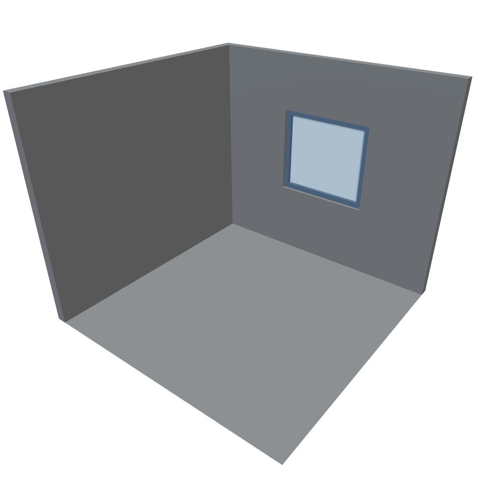
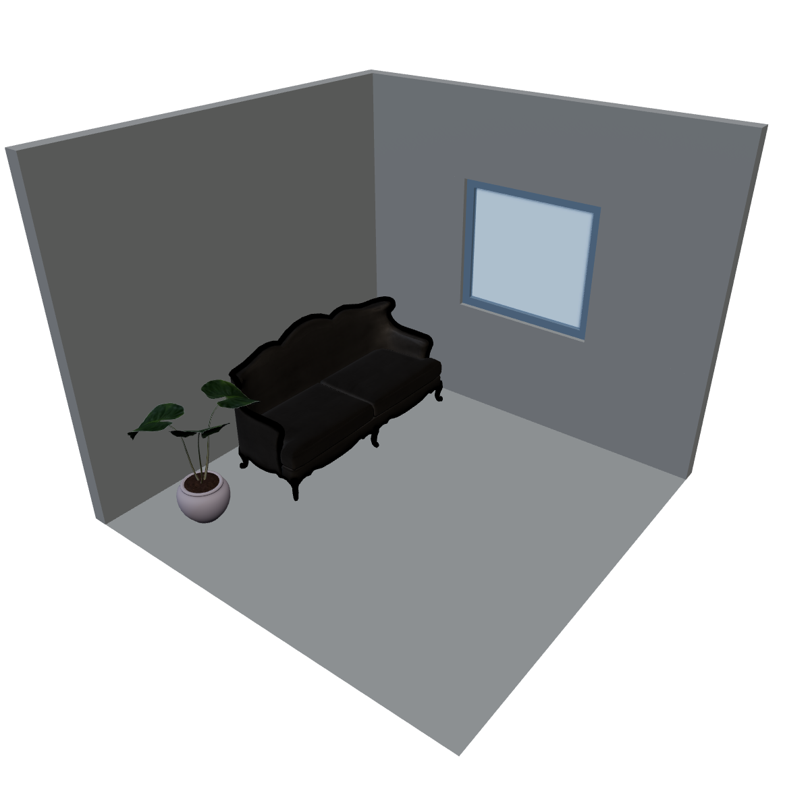
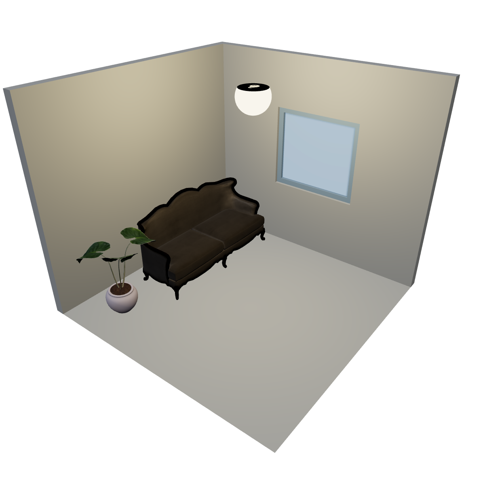
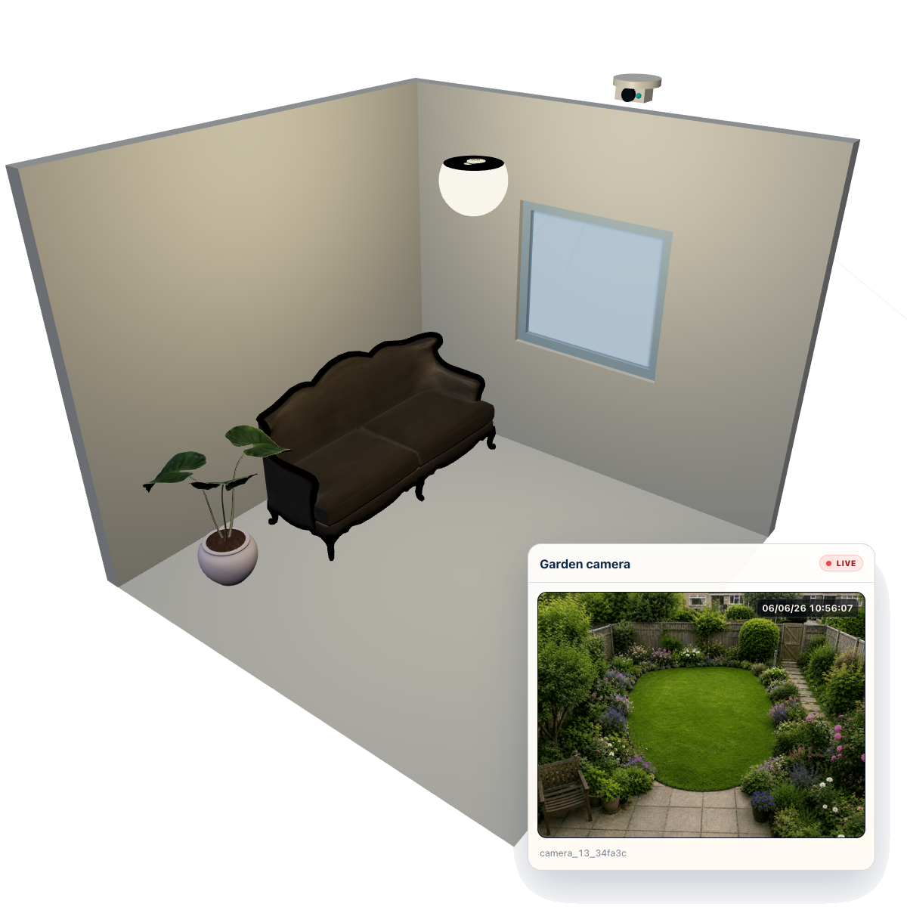
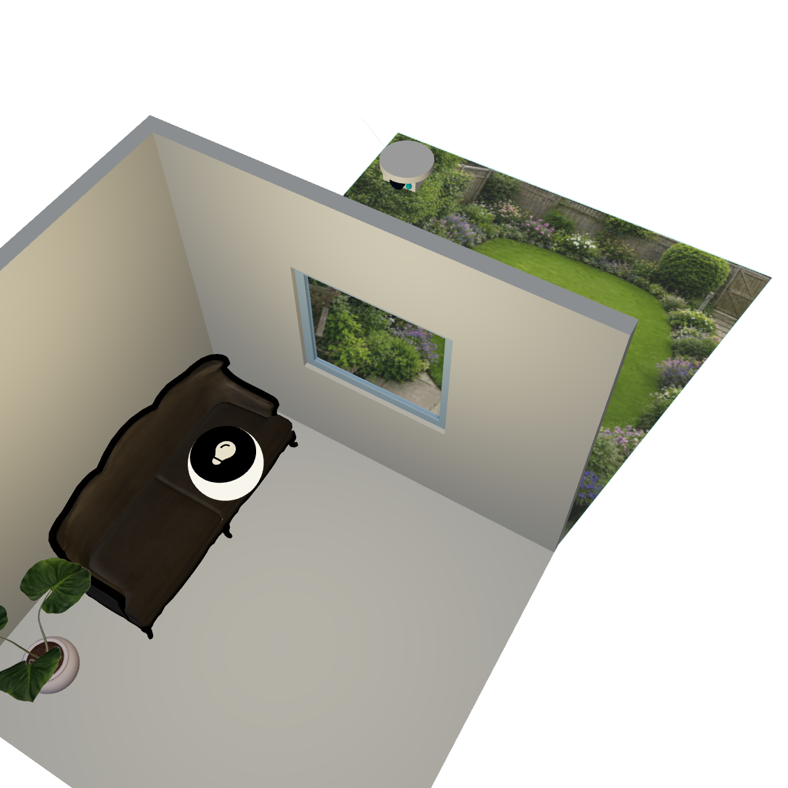
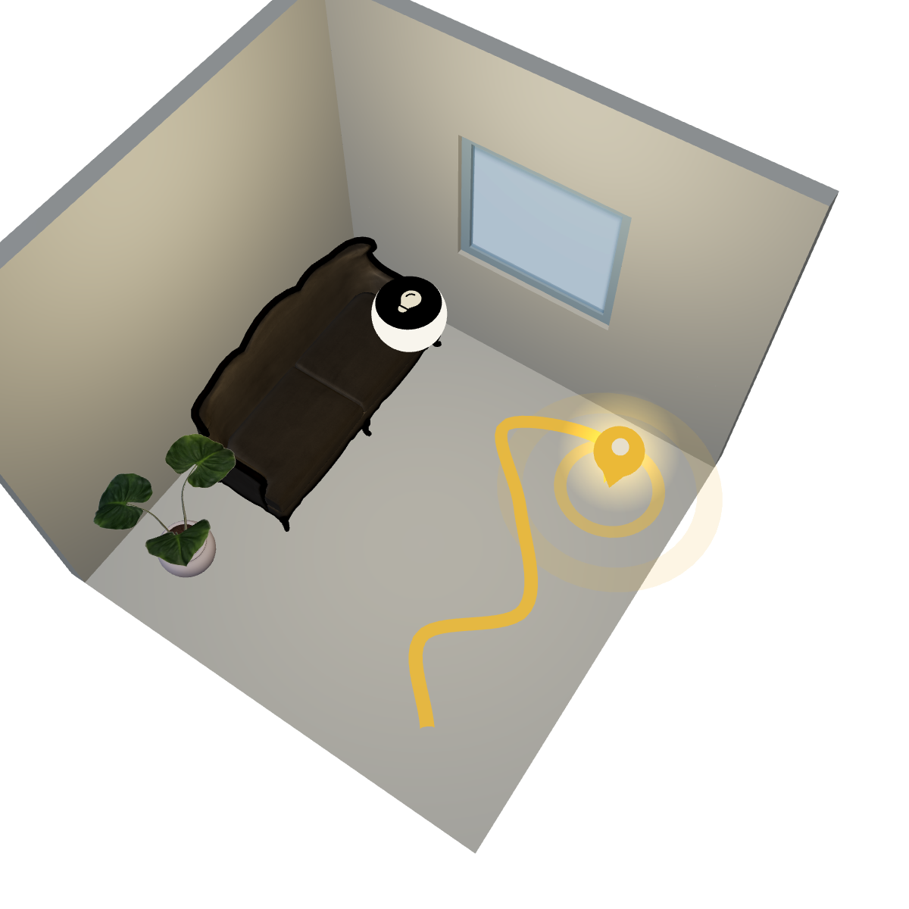
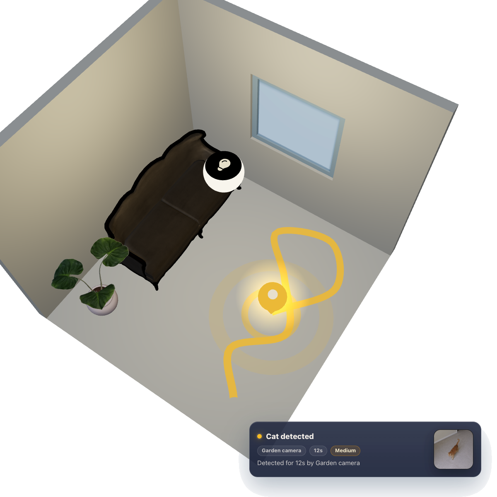

<p align="center">
  <a href="https://toposync.com/">
    
  </a>
</p>

# Toposync

[English](README.md)

**Toposync** é uma **plataforma open source, local-first, em estágio alpha** para **Spatial Home Automation com inteligência local**: automação residencial com contexto espacial, **Spatial Intelligence**, **Spatial Camera Mapping**, **Spatial Events** e visualização 2D/3D da casa em ambientes residenciais privados, opcionalmente integrada ao Home Assistant.

O objetivo é transformar uma casa inteligente em um ambiente visual e interpretável: câmeras, áreas, dispositivos, automações, notificações e eventos podem existir dentro de um mapa 2D/3D da casa.

A categoria que o Toposync está explorando é **Spatial Home Automation**. Na prática:

- **Spatial Camera Mapping** conecta imagens de câmeras a posições, áreas e visões reais dentro do modelo da casa.
- **Spatial Events** são eventos de câmera ou automação com posição, área, câmera, estado do objeto e contexto.
- **Spatial Intelligence** é a camada local mais ampla de interpretação que pode combinar câmeras, áreas, dispositivos, pipelines e histórico.
- **Spatial Awareness** é linguagem de recurso para comportamento sensível a áreas, como reagir de forma diferente perto de portão, piscina, garagem, calçada ou entrada.

> O Toposync está atualmente em **alpha early access**. Ele já pode ser testado por early adopters, usuários avançados de automação residencial, usuários de Home Assistant, usuários de câmeras IP, RTSP/ONVIF, entusiastas de homelab e pessoas interessadas em visão computacional local.

> **Aviso importante:** o Toposync pode fornecer camadas adicionais de visualização, automação e consciência situacional, mas ele **não** substitui sistemas de segurança certificados, sensores dedicados, supervisão humana ou equipamentos de proteção. Não dependa dele ainda para automação crítica, monitoramento de segurança sem supervisão, fluxos de emergência, controle de acesso ou qualquer automação em que uma falha possa causar dano, prejuízo material, exposição de privacidade ou perda de serviço essencial.

## Alpha early access

Esta fase é principalmente sobre **caça a bugs, validação de integrações e testes no mundo real**.

Existem muitas combinações possíveis de câmeras, dispositivos, marcas, protocolos, redes, GPUs, sistemas operacionais, instalações de Home Assistant, navegadores, apps e modos de streaming. Testes da comunidade são essenciais para validar tudo isso.

Você pode ajudar:

- testando o Toposync em diferentes ambientes contidos, seguindo as orientações de segurança em [SECURITY.md](SECURITY.md);
- abrindo issues para bugs encontrados;
- compartilhando logs sanitizados, modelos de câmera, protocolos e cenários de uso;
- sugerindo melhorias de UX, documentação e instalação;
- validando Home Assistant, RTSP, ONVIF, PTZ, streaming e integrações de hardware;
- contribuindo com código, documentação, pipelines e exemplos;
- preparando futuras extensões de terceiros;
- apoiando o desenvolvimento pelo [GitHub Sponsors](https://github.com/sponsors/mateuscalza).

> **Problemas de segurança:** não publique detalhes de vulnerabilidades em issues públicas. Siga o [SECURITY.md](SECURITY.md) e use o private vulnerability reporting do GitHub ou um GitHub Security Advisory privado quando disponível.

## Prévia da visualização 3D

O fluxo atual de visualização do Toposync transforma progressivamente um cômodo mapeado em um modelo residencial interpretável: estrutura, objetos 3D, dispositivos, contexto de câmera, projeção espacial, rastros de movimento e notificações de evento.

<table>
  <tr>
    <td width="25%" align="center">
      
      <br />
      <sub><strong>Estrutura</strong></sub>
    </td>
    <td width="25%" align="center">
      
      <br />
      <sub><strong>Modelos 3D</strong></sub>
    </td>
    <td width="25%" align="center">
      
      <br />
      <sub><strong>Dispositivos</strong></sub>
    </td>
    <td width="25%" align="center">
      
      <br />
      <sub><strong>Transmissão da câmera</strong></sub>
    </td>
  </tr>
  <tr>
    <td width="25%" align="center">
      
      <br />
      <sub><strong>Visão espacial 360</strong></sub>
    </td>
    <td width="25%" align="center">
      
      <br />
      <sub><strong>Rastro de mapeamento</strong></sub>
    </td>
    <td width="25%" align="center">
      
      <br />
      <sub><strong>Notificações</strong></sub>
    </td>
  </tr>
</table>

## O que você pode construir com Toposync?

| Caso de uso | O que permite | Status |
| --- | --- | --- |
| **Visão 2D/3D da casa** | Visualizar casa, cômodos, áreas, dispositivos, câmeras e entidades em um modelo espacial. | **Pronto para teste** |
| **Spatial Home Automation** | Ver luzes, câmeras, sensores e dispositivos dentro da representação da casa, com estados visuais como luzes ativas, entidades selecionadas ou itens ativos. | **Pronto para teste** |
| **Spatial Events** | Transformar detecções de câmera em eventos posicionados em áreas reais da casa. Em vez de saber só que algo foi detectado, ver onde aconteceu. | **Pronto para teste** |
| **Rastreamento espacial** | Rastrear objetos, pessoas ou eventos ao longo do tempo e associar seus caminhos a áreas da casa. | **Pronto para teste** |
| **Spatial Awareness na entrada** | Detectar pessoas, veículos ou entregas parados perto do portão, garagem, calçada ou entrada. | **Pronto para teste** |
| **Objetos parados relevantes** | Criar regras para coisas que realmente pararam em uma área, em vez de reagir a qualquer movimento rápido. | **Pronto para teste** |
| **Spatial Awareness para áreas sensíveis** | Adicionar uma camada extra de consciência em locais como piscinas, portões, garagens, quintais ou áreas restritas. | **Pronto para teste** |
| **Pets perto de áreas sensíveis** | Combinar detecção, áreas e notificações para perceber situações relevantes envolvendo pets perto de piscinas, ruas ou portões. | **Pronto para teste** |
| **Visão espacial 360** | Projetar imagens de câmeras no modelo 2D/3D, criando uma visualização inspirada em sistemas de câmera 360 de carros. | **Experimento inicial** |
| **Câmeras multi-marca** | Trazer câmeras RTSP/ONVIF de marcas diferentes para uma única interface local. | **Pronto para teste** |
| **IA local centralizada** | Rodar modelos e pipelines em uma máquina local como mini PC, servidor, NAS ou desktop com GPU. | **Pronto para teste** |
| **Hardware ocioso como servidor de IA** | Usar uma máquina existente para processar câmeras e automações quando ela estiver disponível. | **Pronto para teste** |
| **Câmeras comuns com inteligência local** | Usar câmeras simples como fontes de imagem e concentrar inteligência em uma plataforma local mais flexível. | **Pronto para teste** |
| **Detecção além da câmera** | Usar modelos e pipelines mais avançados que a IA embutida de cada câmera, incluindo objetos distantes ou condições visuais específicas. | **Pronto para teste, avançado** |
| **Pipelines locais de IA** | Combinar entrada de câmera, detecção, rastreamento, filtros, áreas, notificações e ações em fluxos customizáveis. | **Pronto para teste** |
| **Regras espaciais por área** | A mesma detecção pode significar coisas diferentes dependendo da área. Uma pessoa na calçada pode ser normal; a mesma pessoa no quintal em outro horário pode gerar alerta. | **Pronto para teste** |
| **Notificações contextuais** | Receber notificações com localização, tipo de evento, área, imagem associada e estado do objeto. | **Pronto para teste** |
| **Entregas e campainhas** | Detectar entregadores, pacotes ou pessoas perto da entrada, mesmo antes de alguém tocar a campainha. | **Pronto para teste** |
| **Linhas do tempo ricas** | Guardar eventos interpretados com horário, área, objeto, imagem e contexto, facilitando encontrar ocorrências sem assistir horas de vídeo. | **Pronto para teste** |
| **Histórico baseado em eventos** | Guardar eventos, capturas, recortes e metadados em vez de depender apenas de gravação contínua. | **Pronto para teste** |
| **Histórico longo mais eficiente** | Como eventos podem guardar imagens, recortes e metadados relevantes, o histórico útil pode durar mais usando menos armazenamento. | **Pronto para teste** |
| **Controle contextual** | Ao visualizar uma câmera, stream ou área, acessar dispositivos relacionados como luzes, portões, fechaduras, sirenes, tomadas ou entidades. | **Pronto para teste** |
| **Iluminação inteligente espacial** | Usar posições de eventos para acionar luzes próximas, criar automações baseadas em caminho ou visualizar áreas iluminadas em 3D. | **Pronto para teste** |
| **Integração opcional com Home Assistant** | Usar o Toposync de forma independente ou integrá-lo ao Home Assistant para visualizar entidades, estados, automações e dispositivos no espaço da casa. | **Pronto para teste** |
| **Home Assistant como saída** | Transformar eventos visuais em notificações, estados, sensores binários e automações no Home Assistant. | **Pronto para teste** |
| **ONVIF, RTSP e PTZ** | Descobrir câmeras, testar conexões, capturar snapshots, usar fontes RTSP e controlar câmeras PTZ quando suportado. | **Pronto para teste** |
| **Streaming local** | Publicar streams para dashboards, navegadores, integrações e uso local mantendo a lógica dentro do seu próprio ambiente. | **Pronto para teste, opcional** |
| **Picture-in-Picture e TV** | Levar streams e eventos para uma experiência de app/TV pensada com Picture-in-Picture. | **Em breve** |
| **App Android e iOS** | Acessar o mapa 3D, streams, notificações e configurações em dispositivos móveis. | **Em breve** |
| **Android TV e Apple TV** | Usar streams, eventos e visualizações em telas grandes, com foco em monitoramento residencial. | **Em breve** |
| **Modelos customizados** | Testar modelos customizados para detectar objetos, situações ou padrões específicos do seu ambiente. | **Pronto para teste, avançado** |
| **Segmentação e recortes inteligentes** | Usar IA para filtrar, recortar ou destacar objetos e regiões relevantes em uma imagem. | **Pronto para teste, avançado** |
| **Processamento distribuído** | Rodar processamento pesado em outra máquina da rede, separando a instância principal da carga de IA. | **Pronto para teste, avançado** |
| **Privacidade local-first** | Rodar na sua própria infraestrutura sem depender de processamento em nuvem para imagens da sua casa. | **Pronto para teste** |
| **Extensões e experimentação** | O Toposync foi desenhado como uma plataforma extensível para novas integrações, elementos 3D, pipelines, modelos e formas de visualizar a casa. | **Pronto para teste, avançado** |
| **Extensões de terceiros** | A arquitetura abre caminho para extensões da comunidade com backend e UI próprios. | **Em preparação** |

## Para quem é este alpha?

O Toposync ainda não é uma solução final polida com setup sem atrito. Nesta fase, ele é mais indicado para:

- usuários avançados de Home Assistant;
- pessoas que já usam câmeras IP, RTSP ou ONVIF;
- entusiastas de homelab;
- makers de automação residencial;
- desenvolvedores interessados em visão computacional local;
- criadores de conteúdo de automação residencial;
- pequenos integradores que querem testar ideias novas;
- pessoas confortáveis com software alpha e troubleshooting técnico.

Se você gosta de testar cedo, abrir issues, validar hardware real e ajudar a moldar uma plataforma open source, este é o momento certo para participar.

## Instalação

O Toposync suporta múltiplos caminhos de instalação dependendo do ambiente:

- add-on do Home Assistant;
- Docker/self-hosting;
- instalação Python/uv;
- servidores de processamento;
- ambiente de desenvolvimento;
- app mobile/TV em uma versão futura.

Para uma instalação Python direta, Python 3.12 é recomendado:

```bash
uv venv .venv --python 3.12
source .venv/bin/activate
uv pip install toposync
toposync serve
```

Abra:

```text
http://127.0.0.1:8000/
```

No Windows PowerShell:

```powershell
uv venv .venv --python 3.12
.venv\Scripts\Activate.ps1
uv pip install toposync
toposync serve
```

Upgrades opcionais:

```bash
uv pip install toposync-streaming
uv pip install toposync-vision-cuda
uv pip install toposync-vision-directml
```

Use CUDA para hosts NVIDIA e DirectML para aceleração por GPU no Windows. Streaming é opcional porque traz requisitos adicionais de runtime de mídia.

Comece pelos guias de instalação:

- [Escolha sua instalação](docs-site/i18n/pt-BR/docusaurus-plugin-content-docs/current/installation/choose-your-installation.mdx)
- [Python no Linux e macOS](docs-site/i18n/pt-BR/docusaurus-plugin-content-docs/current/installation/python-linux-macos.mdx)
- [Python no Windows](docs-site/i18n/pt-BR/docusaurus-plugin-content-docs/current/installation/python-windows.mdx)
- [Docker CPU](docs-site/i18n/pt-BR/docusaurus-plugin-content-docs/current/installation/docker-cpu.mdx)
- [Docker CUDA](docs-site/i18n/pt-BR/docusaurus-plugin-content-docs/current/installation/docker-cuda.mdx)
- [Add-on do Home Assistant](docs-site/i18n/pt-BR/docusaurus-plugin-content-docs/current/installation/home-assistant-addon.mdx)
- [Servidores de processamento](docs-site/i18n/pt-BR/docusaurus-plugin-content-docs/current/installation/processing-server-linux-macos.mdx)
- [Compatibilidade](docs-site/i18n/pt-BR/docusaurus-plugin-content-docs/current/installation/architecture-support.mdx)

## Home Assistant

O Toposync pode rodar como add-on do Home Assistant com ingress na sidebar, execução supervisionada, acesso por porta direta quando habilitado e acesso interno à Home Assistant Core API.

Use o repositório dedicado do add-on:

```text
https://github.com/toposync/toposync-homeassistant-addon
```

Comece pela [instalação do add-on do Home Assistant](docs-site/i18n/pt-BR/docusaurus-plugin-content-docs/current/installation/home-assistant-addon.mdx). Em Raspberry Pi e HAOS, trate o add-on como um servidor origin leve e delegue visão pesada ou processamento de múltiplas câmeras para um servidor de processamento quando necessário.

## Desenvolvimento

Pré-requisitos:

- Python 3.12;
- `uv`;
- Node 20 ou mais novo;
- npm.

Na raiz do repositório:

```bash
uv sync
npm install
npm run build:extensions
TOPOSYNC_AUTH_MODE=bypass npm run dev
```

Abra:

```text
http://127.0.0.1:5173/
```

O diretório de dados padrão de desenvolvimento é `.toposync-data`.

Veja [Ambiente de desenvolvimento](docs-site/i18n/pt-BR/docusaurus-plugin-content-docs/current/developers/development-setup.mdx) para o fluxo local completo.

## Mapa do repositório

- `src/toposync`: backend core, API, extension manager, runtime de pipelines, processing server.
- `frontend`: host frontend React/ThreeJS.
- `packages/plugin-api`: contrato TypeScript público para extensões frontend.
- `packages/toposync`: bundle Python padrão do produto.
- `packages/toposync-streaming`: bundle de streaming.
- `packages/toposync-vision-cuda`: bundle de upgrade NVIDIA CUDA.
- `packages/toposync-vision-directml`: bundle de upgrade Windows DirectML.
- `extensions`: pacotes de extensões first-party.
- `docs-site`: site de documentação Docusaurus.
- `integrations/home_assistant`: integração Home Assistant e assets relacionados ao add-on.
- `scripts`: scripts de distribuição, validação e serviços.

## Documentação

A documentação vive em `docs-site`.

Pontos de partida úteis:

- [Instalação](docs-site/i18n/pt-BR/docusaurus-plugin-content-docs/current/installation/choose-your-installation.mdx)
- [Compatibilidade](docs-site/i18n/pt-BR/docusaurus-plugin-content-docs/current/installation/architecture-support.mdx)
- [Arquitetura](docs-site/i18n/pt-BR/docusaurus-plugin-content-docs/current/developers/architecture.mdx)
- [Autoria de extensões](docs-site/i18n/pt-BR/docusaurus-plugin-content-docs/current/developers/extension-authoring.mdx)
- [Plugin API](docs-site/i18n/pt-BR/docusaurus-plugin-content-docs/current/developers/plugin-api.mdx)
- [Pipelines](docs-site/i18n/pt-BR/docusaurus-plugin-content-docs/current/developers/pipelines.mdx)
- [Identidade visual](docs-site/i18n/pt-BR/docusaurus-plugin-content-docs/current/developers/visual-identity.mdx)
- [Processo de release](docs-site/i18n/pt-BR/docusaurus-plugin-content-docs/current/developers/release-process.mdx)

Rode o site de documentação localmente:

```bash
npm run docs:start
npm run docs:build
```

## Como contribuir

Contribuições são bem-vindas, especialmente durante o alpha.

Você pode ajudar com:

- bug reports;
- testes com câmeras e hardwares diferentes;
- validação de RTSP, ONVIF, PTZ e streaming;
- melhorias de documentação;
- sugestões de UX;
- exemplos de pipelines;
- correções de código;
- extensões futuras;
- traduções;
- divulgação responsável na comunidade de automação residencial.

Ao abrir uma issue, tente incluir:

- sistema operacional;
- método de instalação;
- modelo da câmera ou dispositivo, quando aplicável;
- logs relevantes;
- screenshots ou vídeos curtos, quando útil;
- passos para reproduzir;
- comportamento esperado e comportamento observado.

Leia [CONTRIBUTING.md](CONTRIBUTING.md) antes de abrir um pull request.

Para vulnerabilidades de segurança, não use issues públicas. Veja [SECURITY.md](SECURITY.md).

## Apoie o projeto

Toposync é um projeto open source em estágio inicial, sem cloud obrigatória e sem produto comercial ativo neste momento. O desenvolvimento envolve backend, frontend, visão computacional, streaming, apps, Home Assistant, documentação, testes e suporte para muitos ambientes diferentes.

Se você quiser apoiar o desenvolvimento:

- teste e compartilhe feedback;
- contribua com código ou documentação;
- compartilhe com pessoas que se importam com automação residencial local;
- apoie o mantenedor pelo [GitHub Sponsors](https://github.com/sponsors/mateuscalza).

## Status do projeto

Toposync está em **alpha early access**.

Isso significa:

- algumas partes já funcionam e podem ser testadas;
- alguns recursos são avançados e exigem configuração manual;
- algumas áreas ainda são experimentais;
- o app mobile/TV será lançado em breve;
- instalação e documentação ainda estão sendo organizadas;
- bugs são esperados;
- feedback da comunidade é essencial.

Use, teste, quebre, reporte e ajude a melhorar.

## Suporte e segurança

- Suporte comunitário: [SUPPORT.md](SUPPORT.md)
- Política de segurança: [SECURITY.md](SECURITY.md)

## Licença

Toposync é distribuído sob a [Licença MIT](LICENSE).
