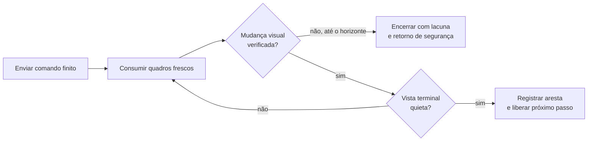

# E6T e E9P3 — chegada visual antes do próximo movimento

## O que mudou

E9P1 e E9P2 usavam a mesma regra: depois do aceite de um pulso finito,
aguardavam uma margem fixa e aceitavam cinco quadros consecutivamente quietos
como a vista terminal. Isso é insuficiente para uma PTZ cujo vídeo ainda mostra
a vista anterior quando a cabeça já recebeu ou encerrou o comando.

E6T iniciou a observação junto do envio de um único pulso de tilt. A resposta
HTTP chegou em 52,1 ms. O estado local do controlador avançou de epoch em cerca
de 289 ms, compatível com o `Stop` protegido pelo watchdog. Mesmo assim, a
primeira diferença visual distribuída só apareceu em 3.645,4 ms. A vista ficou
deslocada aproximadamente 5,7 px no final da janela. A volta absoluta única
acabou quieta e a 0,689 px da âncora.

Esse resultado não prova que a câmera só começou a se mover em 3,6 s: o stream
não fornece timestamp de exposição. Ele prova que a imagem disponível ao
algoritmo ainda não continha a mudança antes desse instante. Logo, uma janela
quieta anterior não pode representar a vista pós-movimento.

## Resultado de E9P3

E9P3 manteve a região de duas faixas e o orçamento de cinco comandos. Para cada
pulso, ele esperou duas condições na sequência do decoder compartilhado:

1. uma correspondência visual distribuída que prove partida da vista de
   referência;
2. quatro pares posteriores quietos que formem a vista terminal.

As voltas absolutas seguiram o mesmo princípio, com correspondência exata à
âncora e quadros frescos posteriores à vista de origem. Nenhum preset,
repetição de comando ou correção fina foi usado.

| Trecho | Partida visual | Terminal visual | Relação final |
| --- | ---: | ---: | --- |
| Base → pan | 1.311,1 ms | 3.003,6 ms | 26,872 px; `x=-22,675`, sobreposição 0,9687 |
| Retorno da faixa base | — | 2.920,2 ms | 0,501 px; sobreposição 0,9964 |
| Base → tilt | 3.962,5 ms | 6.297,4 ms | 5,223 px; `y=5,090`, sobreposição 0,9867 |
| Tilt → pan | 955,3 ms | 3.636,6 ms | 27,925 px; `x=-24,908`, sobreposição 0,9677 |
| Retorno final | — | 3.664,3 ms | 0,685 px; sobreposição 0,9968 |

O grafo das quatro vistas está conectado e os dois retornos passam no limite de
3 px. Portanto E9 está demonstrado para essa pequena região física.

## Decisão de engenharia

O planejador não deve usar um tempo fixo como prova de término. Depois de cada
ação que possa ter alcançado a câmera, ele precisa transitar por:

Uma volta só é aceita quando a âncora visual volta a coincidir em uma janela
quieta. A coordenada ONVIF continua sendo um alvo de aproximação e recuperação,
nunca prova óptica de retorno.

## Limites ainda válidos

- Os tempos observados pertencem à Garagem, `profile_1`, velocidade 0,1 e
  pulso de 0,35 s. Eles não são constantes de produto nem perfis de marca.
- Sem tempo de mídia ou timestamp de exposição, o atraso entre `Stop` local e
  primeira mudança visual permanece classificado como cadeia de observação
  inconclusiva; não deve receber diagnóstico mecânico específico.
- O ensaio prova somente a região pequena. A extensão à faixa inteira precisa
  preservar este gate, aplicar orçamento e aceitar lacunas em vez de avançar
  com uma vista não observada.
- O estado ONVIF de movimento desta câmera retornou `UNKNOWN`; a cronologia do
  controlador foi útil para diagnóstico, mas a aceitação dependeu apenas de
  imagens e sequências frescas.
