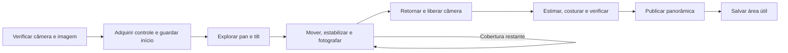
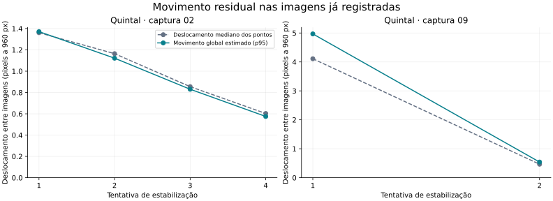

# Panorâmica automática da câmera: investigação e plano de desenvolvimento

Autor: Mateus Calza  
Revisão atual: 10 de setembro de 2026  
Estado: **implementação executada; aceite físico completo reprovado nesta rodada**. A separação dos destinos e o cursor versão 4 foram implementados. Os ensaios reais confirmaram recuperação da referência de trabalho e um retorno ao original dentro do limite, mas ainda reprovaram cobertura completa e repetibilidade do retorno. A captura final guardou 12 fotos, duas em outra altura, sem completar a faixa vertical nem atingir o ponto planejado para testar interrupção e retomada. A validação encontrou e reproduziu também uma decisão prematura de ausência de movimento em vídeo atrasado; a correção temporal passou nos testes automatizados. [Relatório desta entrega](../ignore/panorama-reference-implementation-20260910/README.md). As seções de 9 e 5 de setembro, após o separador histórico, conservam decisões anteriores e não representam o estado atual.

## Revisão vigente: referências corretas e compatibilidade por capacidades — Ponytail full

### 1. Resultado que queremos entregar

A pessoa escolhe a fonte da câmera, inicia a panorâmica e, ao terminar, desenha a área útil. Nenhum campo de distância focal, ângulo, orientação, amplitude dos motores ou velocidade. O Toposync descobre o controle disponível, observa o movimento, captura imagens estáveis e preserva o resultado na fonte para reutilização.

O objetivo é ampliar a cobertura automática em câmeras de fabricantes diferentes, mantendo três resultados independentes: qualidade da imagem, cobertura observada e estado físico da câmera. Uma montagem bonita não prova que toda a rua foi fotografada. Um comando aceito não prova que a câmera voltou.

Esta entrega deve corrigir a referência de recuperação, permitir continuação quando houver um destino verificável e conservar as capacidades já entregues: recorte, revisões do artefato, wizard com um ponto por passo, prévia bidirecional, traduções e mapeamentos legados. A geometria visual continua insuficiente para habilitar apontamento físico sem a geometria do atuador.

**Critérios centrais:** zero campos geométricos; recuperação no enquadramento correto; avanço nos dois sentidos horizontais e nas alturas alcançáveis; retomada sem perder fotos nem repetir movimentos incertos; comportamento explícito quando uma capacidade falta. A certificação de cobertura depende da evidência de cada região, nunca da marca.

### 2. Evidência atual e perguntas restantes

O [relatório real de 10 de setembro](../ignore/panorama-frente-live-20260910/README.md) e seu [manifesto](../ignore/panorama-frente-live-20260910/validation.json) registram:

| Observação | Implicação para o plano |
| --- | --- |
| 12 fotografias guardadas e utilizadas; montagem de 4096 × 2048; p95 visual de 1,731 pixel na escala de 960 pixels | Há imagem aproveitável; reconstrução não é a primeira causa a corrigir. |
| Enquadramento original e referência qualificada diferem 81,29 pixels, apesar de 88,18% de sobreposição | Sobreposição alta não torna dois enquadramentos o mesmo destino. |
| `_return_to_reference_band` usa `saved_return`, mas compara com `cursor.reference_path` | A navegação manda para o original e exige chegada à referência posterior. Corrigir esse contrato compartilhado. |
| Uma retomada acrescentou zero fotos; nenhuma faixa completa; expansão vertical não alcançada | O aceite de continuação, cobertura horizontal e cobertura vertical continua pendente. |
| Retorno final com deslocamento de 5,878 pixels, acima do limite de 3 | Câmera parada, retorno exato não confirmado. É uma limitação distinta da referência errada. |

Os limites existentes de 15 pixels para relocalização e 3 pixels para retorno não serão aumentados para aprovar esse ensaio. O conjunto anterior de 17 fotos pertence a outro ensaio; não serve como comparação controlada com este.

Há evidência suficiente para começar a correção. A causa da primeira falha junto à parede ainda pode envolver suporte visual, paralaxe, distorção ou movimento. Após corrigir a referência, inspecionar os pares rejeitados antes de mudar a reconstrução ou repetir capturas. A correção de navegação não garante, sozinha, cobertura completa.

### 3. Alcance entre fabricantes

O suporte será organizado por operações verificadas. Marca, modelo e firmware são metadados de diagnóstico e validação. Não haverá condicionais por fabricante no scanner, lista fixa de amplitudes ou ajuste exclusivo da Frente.

A especificação ONVIF separa nó PTZ, configuração, perfil de mídia e espaços de coordenadas. Posição e estado de movimento podem ser opcionais; presets dependem da capacidade do nó. Coordenadas genéricas não equivalem automaticamente a graus. Nós também podem representar controle digital. Essas diferenças fundamentam a descoberta, mas a resposta anunciada ainda precisa ser confrontada com a execução. Fonte: [ONVIF PTZ Service Specification 26.06, seções 5.1–5.4 e 5.7](https://www.onvif.org/specs/srv/ptz/ONVIF-PTZ-Service-Spec.pdf).

| Família de capacidades observadas | Estratégia desta entrega | Limite comunicado |
| --- | --- | --- |
| Posição absoluta confiável, eixos e espaços utilizáveis | Salvar destinos absolutos, usar o percurso absoluto existente e verificar chegada por imagem | Telemetria suficiente para comandar não substitui a correspondência visual. |
| Controle contínuo ou relativo e presets utilizáveis, sem posição confiável | Percurso visual existente; destinos temporários distintos para original e referência de trabalho | Retorno depende de preservação e precisão dos presets, comprovadas na chegada. |
| Absoluto incompleto, mas presets confiáveis | Usar presets nos destinos e o movimento utilizável no percurso | Não preencher eixos desconhecidos com zero. |
| Controle contínuo/relativo sem destino absoluto nem presets | Captura local somente com âncoras observadas e parada verificável; retomada apenas onde for possível relocalizar | Recuperação global e retorno automático indisponíveis; resultado pode ser parcial. |
| Apenas pan | Explorar ambos os sentidos e verificar limites ou fechamento de volta | Tilt não aplicável; não apresentar falta de tilt como falha de uma capacidade inexistente. |
| Apenas tilt | Nesta entrega, identificar corretamente e explicar que a varredura exclusivamente vertical ainda não é suportada | Não simular pan nem adaptar todo o scanner para um caso sem evidência de demanda. |
| Pan cíclico, montagem invertida ou mudança de orientação durante tilt | Preservar fechamento visual, medir direções e invalidar resposta local quando a orientação mudar | Não presumir 360 graus, norte, sinal vertical ou continuidade através de uma inversão não verificada. |
| Vários streams, duas lentes, vários nós ou canais de gravador | Vincular explicitamente imagem, perfil e controle; compartilhar exclusão quando o atuador for o mesmo | Uma lente ou canal não fornece referência geométrica automaticamente para outro. |
| PTZ digital, câmera fixa ou somente vídeo | Identificar a limitação e conservar a visualização existente | Sem alegação de explorar novas direções físicas; composição de sensores fixos fica fora. |
| Capacidade anunciada que falha, estado ausente ou firmware inconsistente | Rebaixar somente a operação contradita; tentar alternativa conhecida após reconciliar o estado físico | Falha de permissão, autenticação ou transporte não vira “não suportado” silenciosamente. |

Matriz de fabricantes a preencher durante a evolução: **Reolink, TP-Link Tapo e VIGI, Axis, Hikvision, Dahua, Hanwha Vision, Uniview, Bosch, Amcrest e equipamentos de outros fabricantes que exponham operações compatíveis**. São candidatos de interoperabilidade, não marcas já certificadas. Selecionar equipamentos que acrescentem capacidades diferentes, sem ensaiar dez dispositivos equivalentes só para aumentar a lista.

Cada registro deverá conter modelo, firmware, fonte, caminho de controle, capacidades anunciadas e observadas, tipo de evidência, captura, retomada, retorno e limitações. Evidência pode ser teste sintético, resposta de protocolo preservada ou ensaio físico. A Frente tem ensaio real **parcial/reprovado** nesta revisão; não promover o resultado a uma aprovação da família Reolink.

A conformidade ONVIF se aplica ao produto e à versão de firmware listados na [base oficial de produtos](https://www.onvif.org/conformant-products/). Também existem diferenças entre requisitos de dispositivos e clientes nos [perfis ONVIF](https://www.onvif.org/profiles/profile-t/). Nenhum desses selos será tratado como certificação da panorâmica do Toposync.

### 4. Correção mínima: separar os destinos

Manter três conceitos explícitos dentro do scanner atual:

| Referência | Momento de obtenção | Uso |
| --- | --- | --- |
| Enquadramento original | Antes dos movimentos de pré-voo | Restaurar a vista ao encerrar normalmente ou mediante ação explícita de retorno. |
| Referência de trabalho | Quando `_find_reference` qualifica a imagem da faixa inicial | Recuperar a navegação, inverter o ramo horizontal e iniciar os ramos verticais. |
| Âncora local | Última fotografia qualificada para a transição atual | Confirmar de onde parte o próximo movimento; não exige um preset por fotografia. |

Estender `save_return`, `return_to`, `remove_return` e sua validação de propriedade, em `panorama_capture.py`, com um papel explícito para os dois destinos. Preservar o comportamento padrão do enquadramento original. Evitar uma interface nova de navegação ou outro gerenciador de presets.

O destino deverá conservar papel, tipo, vínculo de fonte/perfil/nó/configuração, assinatura óptica, imagem de referência e, conforme o tipo, posição com espaços/unidades ou token de preset pertencente ao job. Reutilizar metadados já guardados; acrescentar somente os campos necessários para verificar o contrato. Caminhos e credenciais internos não entram na resposta pública.

Ao escolher a referência de trabalho: parar, qualificar uma janela recente, salvar o destino e verificar uma nova observação ainda equivalente antes de persistir o par destino–imagem. Não combinar uma pose atual com uma imagem anterior ao movimento. Uma corrida ou mudança visual nessa janela invalida a associação; não inicia recuperação com dados incompletos.

Reutilizar um único destino apenas se ele representar comprovadamente o mesmo enquadramento e estado óptico. Caso contrário, manter os dois. Nunca reconstruir a referência de trabalho somando ou repetindo `reference_moves`: duração de pulso é uma ação, não uma posição.

### 5. Presets, capacidade limitada e ciclo de vida

Usar, no máximo, dois presets temporários por job: original e referência de trabalho. Preferir posições absolutas confiáveis quando já disponíveis, reduzindo a necessidade de presets. Nome e chave de idempotência devem distinguir job e papel, inclusive sob truncamento imposto pelo dispositivo.

Consultar inventário e capacidade antes de criar. Não editar presets existentes, substituir o Home, apagar o preset de outra sessão nem escolher um token arbitrário. Se houver um único espaço livre, preservar a possibilidade de retorno ao original; obter o destino de trabalho por outro meio verificável ou declarar recuperação limitada. Capacidade desconhecida admite uma criação controlada, sem tentativas de sobrescrever ao receber falha.

Confirmar no inventário o token e nome criados. Se os dois papéis receberem o mesmo token inesperadamente, considerar a associação insegura; não pressupor que o original sobreviveu. Em timeout de criação, reconciliar o inventário antes de repetir. Não criar outro preset apenas porque a resposta se perdeu.

O vínculo pertence ao job estável, enquanto a autorização de movimento pertence à concessão de controle atual. A retomada exige ambos. Verificar novamente propriedade e identidade antes de usar ou remover um preset. Nome e token preservados não provam que ninguém alterou sua posição: toda chegada continua sujeita à validação visual.

Preservar destinos ainda necessários por um job interrompido ou retomável. Ao concluir definitivamente ou descartar o job, remover apenas os presets cuja propriedade for verificável. Remoção pendente fica registrada; limpeza não pode movimentar a câmera. Reutilizar descarte/retenção existentes, sem um serviço periódico novo. Se a limpeza remota falhar, conservar o registro de propriedade necessário à próxima tentativa explícita, sem reter todas as fotografias indefinidamente.

### 6. Descoberta e seleção do caminho de controle

Reutilizar a descoberta em `onvif/client.py`, o adaptador `onvif/reolink_cgi.py`, `ptz_controller.py` e `panorama_capture.py`. Completar informações de presets ou vínculos ausentes somente onde os casos de contrato demonstrarem a necessidade. Não criar adaptadores novos para toda a lista de marcas.

1. Resolver a fonte exata, seu perfil de mídia, configuração PTZ e nó. Associação ambígua interrompe antes do movimento; nunca escolher o primeiro perfil. Gravações e lentes diferentes não se tornam equivalentes pelo nome.
2. Manter capacidade anunciada, observada e desconhecida separadas. Consultas de descoberta permanecem de leitura; não modificar a configuração global da câmera para encaixá-la no algoritmo.
3. Preservar espaços de coordenadas, limites finitos, eixos ausentes e tolerâncias nas unidades corretas. Espaço proprietário sem interpretação implementada não recebe uma conversão aproximada para graus.
4. Adquirir o controle existente e observar uma parada. Provas de movimento ocorrem somente após iniciar a captura e dentro do orçamento; abrir a configuração não movimenta a câmera.
5. Escolher a primeira estratégia suficiente da matriz. Um caminho nativo já existente pode complementar ONVIF, desde que a identidade do canal e as unidades sejam verificadas no adaptador.
6. Antes de trocar de estratégia após timeout, parar e reconciliar a observação. Um comando possivelmente executado não autoriza enviar seu equivalente por outro protocolo.

A exclusão deve cobrir o mesmo atuador físico, mesmo quando duas fontes solicitam captura. Reusar o escopo conservador do controlador; não criar paralelismo por fonte sobre o mesmo motor. Sob associação física incerta, serializar conservadoramente.

Mudança de zoom, lente, recorte digital ou orientação que invalide a assinatura óptica interrompe o job ou exige nova qualificação prevista no scanner. Zoom desconhecido permanece desconhecido; verificar também consistência visual. Presets que alterem zoom precisam restaurar e comprovar o estado óptico compatível antes de reutilizar imagens. Auditar o retorno absoluto atual, que guarda zoom mas comanda pan/tilt: não prometer restauração óptica se ela não foi comandada e observada.

Rastreamento automático, rondas, retorno temporizado e controle externo podem disputar o movimento. Detectar inconsistência e interromper com orientação curta. Não desativar recursos da câmera silenciosamente. A concessão do Toposync não bloqueia aplicativos externos.

### 7. Recuperação e matemática aproveitável

O procedimento será: confirmar parada e controle; procurar equivalência com a âncora atual; caso necessário, comandar o **destino da referência de trabalho**; observar chegada; somente então avançar o cursor e explorar o próximo ramo. `_restore` continua usando exclusivamente o original.

Para um par de imagens, conservar o ajuste robusto existente em `_match`. Se `H` representa a transformação estimada e `p` é um ponto amostrado na imagem, seu deslocamento é `d(p) = ||project(Hp) − p||`. A métrica agregada e a sobreposição devem conservar exatamente a definição atual do helper. Reusar os testes de distribuição espacial, modelo finito e geometria válida; não aprovar uma parede ou objeto móvel só pelo número de correspondências. O [OpenCV documenta o ajuste robusto de homografias e sua máscara de pontos consistentes](https://docs.opencv.org/4.13.0/d9/d0c/group__calib3d.html).

Para relocalização, aplicar os critérios existentes à referência correta: correspondência verificada, sobreposição mínima de 0,85 e deslocamento máximo de 15 pixels na escala de 960, além de imagem recente e estabilidade. Para declarar restauração exata, manter o limite específico de 3 pixels. Essas unidades são visuais, não graus nem garantia de precisão em um ponto distante.

A homografia é evidência local entre vistas compatíveis. Ela não transforma cenas com profundidades diferentes em um único plano, nem resolve toda distorção ou paralaxe. Em regiões pobres de textura, repetitivas, próximas da lente ou dominadas por objetos móveis, preservar a recusa e a lacuna.

**Correção fina:** reaproveitar a correção absoluta limitada já presente em `_restore`, baseada em resposta observada por eixo. Localmente, `e ≈ J Δu`; uma correção usa a pseudoinversa de `J`, com sinal consistente, limites do eixo e verificação da redução do erro. Não transferir a matriz entre lentes, orientações, unidades ou locais muito diferentes. Matriz mal condicionada, piora do erro ou suporte visual insuficiente encerram a correção. Preservar o limite atual de quatro ajustes após a primeira avaliação.

Não adicionar nesta entrega servo global para câmeras sem pose/preset, navegação por grafo, SLAM ou replay de uma trajetória temporal. Sem destino global recuperável, continuar apenas a partir de uma âncora local já verificada. Isso entrega cobertura limitada honesta. A extensão do servo local a comandos relativos/contínuos só entra em outro pacote se ensaios demonstrarem que presets ou retorno absoluto são o bloqueio restante, com estabilidade e orçamento próprios.

### 8. Tempo da captura e cobertura

Manter `VisualStabilityDetector`, não voltar a uma espera fixa. A velocidade aparente usa transformação entre imagens e intervalo de mídia válido; sem essa base temporal, conservar o modo explicitamente limitado de observação, sem chamar o tempo de chegada de timestamp da exposição. A transição observada de movimento para estabilidade ou uma referência temporal física verificada continua obrigatória.

Parâmetros atuais a preservar como ponto de partida: análise em 960 pixels; observação mínima de 0,5 segundo; janela estável de 0,8 segundo e cinco imagens; timeout de 12 segundos por tentativa. Não reduzir limites antes de comparar taxas de imagens antigas, borradas ou mal posicionadas. `MoveStatus=IDLE` é evidência auxiliar, não aprovação isolada da fotografia.

Registrar tempo comandando, aguardando estabilidade, recuperando, retornando e reconstruindo, com contadores existentes. O timeout deve parar a tentativa, preservar as fotos válidas e explicar o resultado. Vento, chuva, carros, relógios sobrepostos, foco e exposição exigem suporte distribuído e consistência temporal; não esperar toda mudança de pixels desaparecer.

O percurso horizontal conserva sobreposição adaptativa, ambos os sentidos e evidência de extremos ou fechamento visual. Ausência repetida de progresso após movimento confirmado pode sustentar um limite observado; falta de textura, congestionamento ou comando sem efeito confirmado não prova batente mecânico. Não inferir amplitude pelo intervalo normalizado informado pelo dispositivo.

Recuperar a referência correta deve permitir tentar o outro lado e depois as alturas alcançáveis. Uma faixa iniciada pelo centro precisa de ambos os lados ou volta verificada. Tilt positivo não significa universalmente chão ou céu. A cobertura vertical deve mostrar fotografias novas e conexões entre faixas, preservando lacunas. O fim de um ramo não certifica o outro.

Manter 256 fotografias, 20 minutos de captura ativa, 64 movimentos por busca e uma tentativa adicional de recuperação por destino no mesmo job. Reutilizar contagem de tempo ativo e limites de finalização; os comandos de parada continuam possíveis após esgotar a aquisição. Reiniciar a interface ou retomar não zera nenhum orçamento.

### 9. Checkpoint, reinício e retomada

Versionar o cursor contínuo de 3 para 4 junto com a leitura na API. Acrescentar o destino de trabalho e seu vínculo à fotografia, mantendo o retorno original compatível. Atualizar intenção, comando pendente, chegada confirmada e contadores de forma atômica nos mecanismos existentes.

`_relocalize` e `_can_resume` precisam concordar sobre o que é estruturalmente recuperável. A API pode oferecer **Tentar continuar** quando existir evidência e um caminho possível, mas a execução ainda confirma conexão, controle e chegada. Quando faltar permanentemente referência, capacidade ou orçamento, expor o motivo e oferecer a montagem salva, sem um botão que repete a mesma falha.

Após reinício: primeiro observar, validar identidade/óptica e reconciliar intenções pendentes. Se já estiver na referência, confirmar sem novo comando. Se estiver longe e ainda houver tentativa disponível, um destino absoluto ou preset do próprio job pode ser acionado em uma nova tentativa contabilizada, após parar e verificar propriedade. Isso é uma nova intenção de alcançar um destino conhecido; nunca reenviar cegamente um pulso contínuo ou deslocamento relativo pendente. Uma intenção de resultado desconhecido continua consumindo sua tentativa. No máximo uma tentativa de recuperação consumida por destino, inclusive entre reinícios.

Cursor antigo continua legível para consulta, download e reconstrução. Só migrar como retomável quando existir equivalência demonstrável entre referência e destino; não inventar o segundo destino a partir do original. O job real de 10 de setembro conserva sua evidência e não recebe uma referência fictícia. Caso a migração não seja comprovável, iniciar um novo job para o novo ensaio.

Parar/cancelar impede novas recuperações e não causa retorno automático. Falha de armazenamento, perda de concessão ou parada incerta bloqueia exploração adicional. A verificação de controle deve continuar valendo no finalizador; não parar o movimento de um novo proprietário para limpar a sessão antiga.

### 10. Experiência minimalista e acessível

Reutilizar `CameraSourcePanoramaSection.tsx`, `PanoramaImage`, recorte e componentes do Toposync. Nenhuma tela nova de perfil geométrico. A referência de trabalho é uma responsabilidade do sistema, não um conceito que o usuário precisa preencher.

| Situação | Apresentação e ação |
| --- | --- |
| Antes de começar | Fonte selecionada, prévia disponível e **Gerar panorâmica**. Informar movimento e eventual limitação de retorno antes do início, sem outro formulário. |
| Preparação | “Preparando a câmera”. Botão de início indisponível enquanto a mesma solicitação estiver pendente; abertura da tela permanece de leitura. |
| Captura | Fase real, fotografias guardadas, tempo decorrido e **Parar** sempre alcançável. |
| Recuperação | “Reposicionando para continuar”. Não anunciar sucesso até reconhecer o destino. |
| Outra altura | “Fotografando outra altura”. Um marco breve de faixa concluída só quando certificado. |
| Parcial com caminho recuperável | Prévia útil e **Tentar continuar**, com indicação de que movimentará a câmera. |
| Parcial sem caminho recuperável | “As fotos estão guardadas. Não foi possível encontrar a referência para continuar.” Montagem/download e opção de nova captura conforme disponibilidade. |
| Zero fotografias | Explicar que nenhuma foto foi guardada; remover a frase contraditória “As fotografias aproveitadas foram guardadas”. |
| Resultado | Imagem, cobertura e câmera em linhas independentes; **Escolher área útil** quando o artefato puder ser usado. |

A resposta local ao clique deve ser imediata, mas chegada e parada não usam sucesso otimista. Percentual ou tempo restante só quando houver denominador ou previsão defensável; varredura de alcance desconhecido mostra fase e tempo decorrido. Sem barra falsa avançando até 99%.

O processo pode continuar no servidor enquanto a pessoa muda de página, conforme o ciclo de vida já existente. Reabrir mostra o mesmo job. Se a conexão de acompanhamento cair, indicar estado desconhecido e reconectar; não concluir que a câmera parou. Não introduzir notificações, novos jobs ou agendamentos.

Gamificação básica significa progresso verdadeiro: primeira imagem útil, faixa verificada, nova altura conectada e trabalho preservado. Sem pontuação, medalhas, confete ou mensagens de certeza quando a captura está parcial. A confiança deve vir da previsibilidade, da capacidade de parar e da preservação do trabalho.

Erros e estado físico continuam visíveis. Detalhes técnicos ficam recolhidos. Manter foco, navegação por teclado, alvos de toque, contraste, zoom do navegador e redução de animação. `aria-live` anuncia mudanças de fase, não cada fotografia; a ação Parar não perde foco com atualizações. Traduzir códigos e plurais em português do Brasil e inglês, incluindo razão de retomada indisponível e zero/uma/várias fotos. Não expor chaves cruas nem mensagens com credenciais.

O wizard existente permanece com um ponto por passo, navegação pelo ponto e fantasmas bidirecionais sujeitos à geometria/confiança disponíveis. A nova captura não deve apagar seus rascunhos, trocar a revisão importada ou habilitar apontamento físico indevidamente. O recorte salvo prevalece sobre o enquadramento automático da prévia.

### 11. Entregas e padrão de código

| Ordem | Alteração delimitada | Arquivos principais | Critério para avançar |
| --- | --- | --- | --- |
| 1 | Reproduzir a divergência original–trabalho e corrigir os dois destinos | `panorama_capture.py`, `panorama_scan.py` e testes correspondentes | Teste falha no fluxo atual; passa ao recuperar a referência correta e restaurar o original distinto. |
| 2 | Propriedade, capacidade e retenção de presets; alternativas de controle | Mesmos arquivos; `onvif/client.py`/controlador somente se houver lacuna demonstrada | Casos de capacidade limitada e timeout não sobrescrevem destinos nem duplicam movimentos. |
| 3 | Cursor versão 4, reinício e coerência da retomada | `panorama_scan.py`, `source_panorama.py`, testes de API | Interrupções em cada fronteira preservam fotos, consumo e possibilidade real de continuação. |
| 4 | Estados da interface, mensagens e acessibilidade | Componente da panorâmica, tipos e traduções existentes | Fluxos completo, parcial, zero fotos e retorno incerto são compreensíveis em ambos os idiomas. |
| 5 | Matriz por capacidades e regressão dos consumidores | Suítes já existentes de protocolo, scanner, API e navegador | Famílias suportadas percorrem casos positivos; famílias limitadas têm resultado correto e explícito. |
| 6 | Ensaio físico limitado e registro de interoperabilidade | Artefatos locais e documentação operacional | Frente demonstra cobertura e retomada nos critérios abaixo; demais famílias mantêm seu nível real de evidência. |

Não criar framework de drivers, fila paralela, banco novo, dependência de visão ou configuração por fabricante. Reusar OpenCV, NumPy, armazenamento, concessão de controle, contratos de erro e ferramentas de teste existentes. Só extrair helper quando houver comportamento compartilhado real entre os dois destinos.

Nomes devem explicitar original, trabalho e âncora local. Validar dados nas fronteiras; não converter `None`, `unknown`, timeout e operação não suportada no mesmo valor. Usar relógio monotônico para orçamento e prazos. Cancelamento precisa atravessar capturas, movimentos e finalização. Os serviços do domínio permanecem na extensão de câmeras; caminhos da interface e chamadas de rede preservam os helpers de base path e ingress do Home Assistant.

Não refatorar reconstrução, wizard, estilos globais ou controlador inteiro junto da correção. Um comentário `ponytail:` cabe no limite deliberado de dois destinos ou recuperação local, quando esclarecer sua extensão futura. Não espalhar comentários de justificativa em cada função.

### 12. Testes automatizados necessários

Ampliar fixtures e parametrizações existentes, mantendo os validadores independentes da função sob teste. Para o caso principal, o simulador deve ter original e referência de trabalho realmente diferentes; apenas conferir qual método foi chamado não basta. Verificar também a imagem atingida e o próximo ramo executado.

| Grupo | Casos obrigatórios | Evidência de aprovação |
| --- | --- | --- |
| Referências | Pré-voo muda a vista; original igual ao trabalho; frame muda durante criação do destino | Recuperação usa a imagem certa; retorno usa o original; associação corrida é recusada. |
| Presets | Dois papéis, capacidade zero/um/dois, token repetido, nomes truncados, criação com resposta perdida, preset alterado/removido | Nenhum preset do usuário modificado; nenhum destino sobrescrito; repetição reconciliada; propriedade validada. |
| Controle | Absoluto confiável, status ausente/inválido, apenas relativo, apenas contínuo, fallback nativo existente | Caminho correto com unidades preservadas; alternativas não duplicam ação incerta. |
| Identidade e óptica | Duas fontes no mesmo motor, dois nós, lente larga/tele, zoom alterado, perfil trocado, espelhamento | Exclusão correta; não aceitar referência de outra origem ou estado óptico. |
| Percurso | Falha no primeiro/segundo lado, faixa posterior, pan cíclico, tilt fixo, montagem invertida, parede sem suporte | Recuperação válida permite ramo restante; lacunas não viram cobertura completa. |
| Retomada | Interrupção antes do comando, depois do envio e antes da confirmação, reinício já na referência ou longe | Nenhum replay de pulso; intenção e orçamento preservados; destino conhecido exige verificação. |
| Compatibilidade | Cursores 2/3/4, campos ausentes, artefato anterior e destino inválido | Leitura/montagem preservadas; migração só com evidência; API e execução concordam. |
| Tempo e imagem | Fila de imagens antigas, sequência repetida, troca de geração, timestamps regressivos, oscilação, tráfego, foco | Nenhuma fotografia aprovada só por espera ou estado IDLE; timeout limitado. |
| Finalização | Parar, perda de controle, falha de disco, timeout de retorno, limpeza falha, orçamento esgotado | Sem exploração adicional; parada e retorno distintos; fotos preservadas; recursos liberados. |
| Interface | Zero/uma/várias fotos, completo/parcial, retomada impossível, desconexão, retorno incerto, crop já salvo | Texto verdadeiro, ações coerentes, acessibilidade e traduções corretas; nenhuma regressão nos pontos. |

Suítes principais: `tests/test_camera_panorama_capture.py`, `tests/test_camera_panorama_scan.py`, `tests/test_camera_source_panorama_api.py`. Incluir `tests/test_camera_onvif_panorama_capabilities.py` e `tests/test_camera_ptz_controller.py` para contratos afetados; `tests/test_camera_panorama_stability.py` para a fronteira temporal, sem reescrever o detector.

Executar primeiro o teste novo e depois as suítes dos arquivos modificados. Exemplo de gate principal: `.venv/bin/python -m pytest tests/test_camera_panorama_capture.py tests/test_camera_panorama_scan.py tests/test_camera_source_panorama_api.py`. Usar o ambiente Python já preparado do repositório, sem instalar outro para esses testes.

Para interface: `npx tsc --noEmit -p extensions/cameras/ui/tsconfig.json`, `npm run build:extension-ui -- cameras`, `npx playwright test --config playwright.source-panorama.config.js` e `npx playwright test --config playwright.panorama.config.js`. Essas configurações executam as suítes de fonte e mapeamento com fixtures nas portas 5178/8108 e 5187/8127, respectivamente. Confirmar a configuração isolada antes de executar; não apontar testes sintéticos para 5174 ou para os dados reais. Rodar Ruff nos arquivos Python alterados e `git diff --check` para fechar. Uma vez aprovado, não repetir checks sem mudança ou falha nova.

Os arquivos de imagem já preservados podem sustentar reprodução local de correspondência, sem publicar imagens residenciais. Sequências sintéticas controladas devem testar estabilidade temporal. Um par de JPEGs não comprova comportamento do motor ou ausência de atraso no vídeo.

### 13. Validação física, custo e abrangência

Este planejamento não executa movimentos. A primeira validação da implementação continua limitada à **Frente Reolink Wide**, na instância principal em 5174. Suporte genérico no software não amplia automaticamente o ensaio para todas as câmeras do usuário.

1. Registrar revisão dos arquivos executados, modelo/firmware quando disponíveis, identidade `camera_reolink_frente / wide_main`, capacidades, inventário de presets e ausência de outro job ativo. Hash de configuração e composições antes, desconsiderando apenas metadata esperada da panorâmica. Não incluir credenciais no relatório.
2. Preservar o job e artefato reprovados. Iniciar pelo botão do Toposync um job novo com o contrato corrigido. Preferir luz e textura suficientes. O próprio produto deve capturar, escolher, recuperar e montar; não ajustar poses, fotos ou parâmetros manualmente durante o aceite.
3. Confirmar que original e referência de trabalho estão associados aos destinos certos. Quando forem diferentes, guardar evidência da diferença e da recuperação correta. Aguardar cobertura da rua nos dois sentidos; uma faixa incompleta permanece reprovação desse critério.
4. Confirmar fotografias novas em outra altura e conexão entre faixas. Procurar expansão acima e abaixo até limites observáveis, sem atribuir sinais universais ao tilt. Se isso falhar, analisar a transição registrada antes de repetir.
5. Após uma faixa adicional válida, usar **Parar** uma vez. Verificar parada e ausência de retorno automático. Usar **Tentar continuar** no mesmo job e exigir progresso novo, hashes antigos iguais e orçamento preservado. Recusa segura não é aprovação do aceite de retomada.
6. Encerrar e separar cobertura, qualidade, parada e retorno exato. Comparar inventário de presets e configuração; remover somente temporários já dispensáveis. Deixar a aplicação rodando e nenhum job ativo. Guardar imagem, máscara, relatório, checkpoint e resumo do ensaio.

Um ensaio inicial; repetição somente após nova hipótese verificável ou correção. Não gastar várias panorâmicas tentando obter casualmente uma aprovação. Se não atingir o ponto de interrupção planejado, registrar esse aceite como não executado.

Depois da Frente, a ampliação física exige combinar o alvo com o usuário. Priorizar uma família com telemetria absoluta diferente, uma com preset sem pose e uma com controle sem destino recuperável, usando dispositivos disponíveis. A matriz automatizada pode abranger todas imediatamente. Registrar “validado em modelo/firmware/fonte X”, sem generalizar a marca ou cada firmware futuro.

### 14. Aceite, riscos e reversão

**Aceite de software:** regressão original–trabalho reproduzida e resolvida; todos os casos relevantes da matriz aprovados; contratos de fonte, propriedade e persistência preservados; interface coerente nos dois idiomas; nenhuma dependência ou formulário geométrico novo. Caminhos declarados como suportados precisam de testes positivos, não apenas bloqueios seguros.

**Aceite físico da Frente:** ambos os lados da faixa útil observados, expansão vertical conectada, interrupção/retomada com novas fotos e finalização observada. Relatar separadamente qualidade da costura, cobertura, retorno e duração. Retorno acima de 3 pixels permanece não confirmado e impede declarar esse recurso validado, mesmo se a captura passar. Alcance total só é declarado quando todos os ramos aplicáveis têm evidência suficiente; o orçamento não transforma regiões desconhecidas em completas.

**Aceite de UX:** em revisão de tarefa, a pessoa inicia sem valores técnicos, encontra Parar, identifica uma limitação e recupera o resultado salvo. Verificar visualmente em desktop e viewport estreito, com teclado e tradução longa. Uma inspeção do desenvolvedor não equivale a estudo com usuários; registrar eventual sessão com participantes apenas quando realizada.

Riscos conhecidos: firmware que altera presets; vídeo atrasado apesar de aparência estável; cena sem textura; objeto próximo dominando correspondência; mudança óptica automática; controle externo; alcance vertical não observável. Todos devem terminar em evidência preservada e capacidade corretamente classificada, sem promessa de universalidade. Correções adicionais precisam de uma falha reproduzida, não de parâmetros específicos da Frente.

Reversão: restaurar somente a alteração de software desta entrega, preservando trabalho paralelo, fotos e configuração. Não rebaixar destrutivamente cursores versão 4 para leitores antigos; manter o leitor compatível ou apresentar o job antigo apenas para consulta/montagem. Limpar presets próprios enquanto o registro de propriedade estiver disponível, sem movimento. Não substituir um artefato aprovado por candidato de qualidade insuficiente; o recorte e a revisão usados pela composição permanecem estáveis.

### 15. Fora desta entrega e uso das skills

Ficam fora: novos protocolos proprietários sem lacuna concreta, funcionamento em câmera exclusivamente cloud sem integração local, atualização de firmware, controle por IA durante a captura, servo global sem pose, panorâmica multissensor estática, scanner exclusivamente vertical, calibração métrica do floorplan, ativação de apontamento com geometria visual apenas, nova costura, captura simultânea de lentes e ensaios físicos indiscriminados. Nenhum campo manual será acrescentado para contornar esses limites.

| Skill aplicada | Consequência concreta |
| --- | --- |
| [Ponytail full](/Users/c/.codex/plugins/cache/ponytail/ponytail/4.9.0/skills/ponytail/SKILL.md) | Corrigir o contrato dos destinos no fluxo existente; reaproveitar detector, montagem, controle e fixtures. Sem framework de compatibilidade. |
| [Control: power versus simplicity](/Users/c/.codex/plugins/cache/universal-design-principles/interaction-and-control-principles/1.0.0/skills/control-power-vs-simplicity/SKILL.md) | Fluxo principal com fonte, início, parada e recorte; capacidades e diagnóstico detalhado disponíveis sem formulário técnico. |
| [Feedback: states and latency](/Users/c/.codex/plugins/cache/universal-design-principles/interaction-and-control-principles/1.0.0/skills/feedback-loop-states-and-latency/SKILL.md) | Resposta ao clique, fase real, trabalho preservado, recuperação clara e ausência de sucesso físico otimista. |
| [Ockham: equivalent designs](/Users/c/.codex/plugins/cache/universal-design-principles/process-and-robustness-principles/1.0.0/skills/ockhams-equivalent-designs/SKILL.md) | Dois destinos são necessários porque um só falhou; uma arquitetura de navegação geral ainda não demonstrou necessidade. Simplicidade preserva acessibilidade e recuperação. |

Chrome DevTools pode apoiar a inspeção posterior de foco, rede e estados reais da interface. Playwright e pytest continuam responsáveis pela regressão repetível. Ferramentas adicionais de design, geração de imagens ou instalação de plugins não são necessárias para esta correção. As imagens de aceite devem ser produzidas pelo Toposync e pela câmera.

---

## Histórico anterior à revisão de 10 de setembro

As seções seguintes preservam requisitos, pesquisa e evolução anteriores. Em caso de divergência sobre escopo, versão de cursor, autorização ou estado da entrega, prevalece a revisão vigente acima. O [registro da implementação](panoramica-automatica-implementacao.md) distingue entregas de software e ensaios físicos.

## Situação da implementação em 9 de setembro

Os dois pacotes abaixo foram implementados: recuperação do scanner com cursor versão 3, apresentação da cobertura e wizard orientado por pontos com prévia bidirecional. A validação desta entrega usa somente dados sintéticos, testes automatizados e servidores locais isolados.

**Estado histórico de 9 de setembro:** a validação real estava suspensa a pedido do usuário. A autorização foi retomada depois e o ensaio da Frente em 10 de setembro reprovou o aceite físico, conforme a revisão vigente. O estudo com participantes continua proposto, sem resultados atribuídos a pessoas reais.

Panorâmicas da fonte com geometria canônica compatível já podem originar um rascunho na composição. A prévia visual não estabelece a conversão para os eixos do motor: sem geometria de posicionamento verificada, o sistema conserva os pontos e a prévia, mas bloqueia conferência física, apontamento e ativação desse novo recurso. Mapeamentos legados mantêm seus critérios e funcionamento. Veja o [registro da implementação](panoramica-automatica-implementacao.md) para testes e limitações.

## Próxima entrega: recuperação e cobertura vertical — Ponytail full

Planejado em 9 de setembro de 2026 e implementado posteriormente. Esta seção conserva os requisitos e critérios de aceite daquela entrega; a revisão de 5 de setembro abaixo conserva o histórico anterior. Para o resultado físico e a próxima correção, consultar a revisão vigente de 10 de setembro.

### Objetivo e aceite principal

Uma dificuldade visual localizada deve deixar uma região pendente e permitir explorar as demais regiões que possam ser alcançadas com referência confirmada. A câmera deve conseguir sair da faixa horizontal para explorar os dois sentidos disponíveis do tilt, mesmo quando uma extremidade horizontal não puder ser confirmada.

O usuário continua escolhendo a câmera/fonte, iniciando a captura e selecionando a área útil. Nenhum campo geométrico novo. A solução continua genérica por capacidades; a próxima validação física será **somente na Frente Reolink, fonte Wide**, por instrução do usuário.

O aceite exige duas coisas distintas: transições seguras diante de falhas e obtenção de cobertura adicional quando a cena permite. Encerrar com resultado parcial é correto quando a referência se perde, mas não comprova que a exploração vertical foi resolvida.

### Evidência e causa a corrigir

O último ensaio registrado reuniu 17 fotos da rua nos dois sentidos, com p95 experimental de alinhamento de 2,46 pixels a 960 pixels de largura. Ficaram sem confirmação os extremos mecânicos, a expansão vertical completa e o retorno exato. A retomada física anterior foi recusada por falta de correspondência suficiente. Esses são resultados históricos, não uma consulta ao estado atual da câmera.

No código, a recuperação horizontal em `_continuous_scan` está limitada à primeira faixa e ao primeiro sentido (`row == 0`, `direction == -1`). Uma falha equivalente no outro sentido ou em outra faixa ainda encerra a captura. Além disso:

- `_move` pode deixar `last_frame` apontando para uma imagem rejeitada; ela não é uma âncora de navegação.
- `_next_band` depende de `band.end_path`, atualmente criado ao terminar uma busca horizontal com sucesso.
- `_return_to_reference_band` retorna à faixa zero; não recupera uma faixa arbitrária.
- Uma faixa não inicial pode ser marcada completa ao alcançar apenas um limite, presumindo que começou na borda oposta. Essa presunção deixa de valer se ela partir de uma referência central.
- `_absolute_scan` já conserva posições pendentes e conexões verificadas. Esse comportamento deve ser preservado, sem reescrever o percurso absoluto.

### Decisões técnicas mínimas

Modificar as transições do scanner existente. Reutilizar `_seek`, `_pulse`, `_move`, `_accept`, `_next_band`, `_return_to_reference_band`, `_relocalize`, armazenamento do job e publicação dos artefatos. Não criar outro planejador, fila de tarefas, serviço, modelo de IA ou dependência.

| Evento | Próxima ação | Evidência exigida |
| --- | --- | --- |
| Falha visual localizada em pan, em qualquer sentido/faixa | Preservar fotos e marcar apenas o trecho afetado como pendente; preparar recuperação | Mesmo proprietário do controle, parada confirmada e orçamento disponível |
| Enquadramento atual ainda ligado a uma foto válida da faixa | Usar essa referência local para a próxima transição vertical | Imagem nova, estabilidade e correspondência verificadas; nunca apenas o último comando enviado |
| Referência local indisponível | Retornar à referência inicial validada e escolher um ramo vertical ainda não explorado ou o outro lado horizontal pendente | Retorno observado e localização confirmada antes de novo movimento exploratório |
| Falha de conexão vertical | Preservar intermediárias válidas; deixar o ramo incompleto e tentar o ramo oposto pela referência | Recuperação confirmada; não transformar ausência de movimento em limite |
| Nenhuma referência ou nenhum ramo seguro restante | Encerrar parcial e montar as fotos aproveitáveis | Motivo legível; sem avanço presumido |
| Stop, cancelamento, perda de controle, parada incerta, mudança óptica ou erro de persistência | Interromper a exploração pelo fluxo de segurança existente | Nenhuma recuperação automática que reacquira controle ou descarte evidências |
| Limite de tempo, fotografias ou tentativas atingido | Encerrar parcial e executar a finalização segura existente | Contadores preservados; não aumentar limites para fazer o ensaio passar |

Não basta ampliar um `except` e executar `continue`. A próxima ação deve ser determinada somente depois de validar a referência da qual ela partirá.

**Política de recuperação:** no máximo uma tentativa adicional de recuperação por destino no mesmo job, além das repetições de pulso já existentes. Persistir esse consumo antes do comando. Se uma faixa posterior perder a referência, deixá-la pendente e tentar um ramo ainda seguro a partir da faixa zero; não criar navegação genérica entre faixas nem reproduzir às cegas durações antigas de pulsos. Essa é uma simplificação deliberada: recuperar uma região arbitrária através de várias faixas só entra quando houver necessidade demonstrada e cadeia visual suficiente.

**Cobertura:** uma faixa iniciada pelo centro precisa verificar os dois sentidos ou fechar uma volta visualmente. A condição `row != 0` não pode, sozinha, certificar uma faixa completa. Registrar a origem da faixa e a evidência dos seus limites; não copiar confirmação de outra altura sem prova aplicável. Fotografias, faixas concluídas, qualidade da montagem e alcance mecânico são medidas diferentes.

### Desenvolvimento em três entregas

**1. Percurso e checkpoint.** Em `panorama_scan.py`, centralizar a decisão de recuperação em um pequeno helper privado usado nas transições horizontais e verticais. Ele decide a próxima ação; os helpers atuais continuam responsáveis por movimentar e validar. Guardar no cursor a âncora válida, destino da recuperação, ramo/sentido e tentativas consumidas. Preservar os lados não confirmados e fotografias já qualificadas.

Estender o retorno existente para declarar explicitamente se a próxima ação será pan ou expansão vertical a partir da faixa zero. Separar a âncora de transição do antigo `end_path`: uma busca horizontal incompleta pode não ter ponto final válido. Após recuperação central, planejar a nova faixa com ambos os sentidos pendentes.

Persistir intenção antes do movimento e confirmação depois da observação. Uma interrupção entre ambos deixa uma transição não confirmada, que exige relocalização; não é autorização para reenviar automaticamente o comando. Fotografias intermediárias válidas permanecem no job, sem criar faixa completa fictícia.

Como a semântica do cursor muda, usar uma versão nova e atualizar conjuntamente a leitura e `_can_resume` em `source_panorama.py`. Jobs antigos continuam disponíveis para consulta, montagem e retorno compatível; não converter campos ausentes em evidência de localização. Migrar somente dados cuja equivalência possa ser demonstrada; na ausência disso, explicar que a captura anterior não pode ser continuada por esse percurso.

Conservar os limites existentes de 256 fotos, 20 minutos de captura ativa e 64 movimentos por busca. Tempo ativo e tentativas consumidas devem sobreviver à retomada; tempo em pausa não conta como captura. Stop e finalização segura continuam possíveis após esgotamento do orçamento.

Aceite: falha no segundo lado horizontal não impede tentar tilt após recuperação verificada; falha numa faixa posterior não destrói as anteriores nem inicia outra faixa de posição incerta.

**2. Progresso e apresentação.** Ajustar `CameraSourcePanoramaSection.tsx`, traduções existentes e os tipos estritamente necessários. Usar a fase real do scanner para distinguir captura horizontal, recuperação da referência e exploração de outra altura. `primary_complete == false` não deve manter o título “Capturando a faixa de referência” durante toda a expansão vertical.

Apresentar três fatos independentes, em linhas curtas no componente atual:

- **Imagem:** disponível ou montagem que precisa de revisão, conforme a qualidade do artefato exibido.
- **Cobertura:** faixas confirmadas e regiões pendentes, sem percentual de alcance desconhecido.
- **Câmera:** retorno confirmado, câmera parada sem retorno exato confirmado, ou parada não confirmada.

Exemplos de feedback: “17 fotografias guardadas”, “Explorando outra altura” e “Uma região ficou pendente. Continuamos pelas demais.” A última frase só aparece após a continuação ter sido iniciada. Manter o marco de faixa concluída exclusivamente para cobertura confirmada. Essa é a gamificação desta entrega: progresso concreto e pequenos marcos, sem pontos, medalhas ou promessas de conclusão.

Reaproveitar `coverage.bounds_pixels`, já produzido pela reconstrução, para enquadrar inicialmente a área fotografada na prévia. Usar `PanoramaImage` e os helpers de `panoramaCrop.ts`; não analisar pixels pretos nem criar outro visualizador. O retângulo de apresentação normalizado é `(left/W, top/H, (right-left)/W, (bottom-top)/H)`, respeitando o contrato de bordas exclusivas já existente. Validar valores finitos e limites; metadados ausentes ou inválidos usam a imagem inteira. Quando o conteúdo cruza a emenda, aceitar o retângulo conservador fornecido pelo artefato; não adicionar outro otimizador de emenda.

Esse enquadramento é apenas apresentação. O recorte explicitamente salvo pelo usuário prevalece; “Imagem inteira” e download original continuam disponíveis. Não gravar um recorte automaticamente nem mudar coordenadas de edição, máscara ou procedência. Preservar avisos da revisão exibida, foco do diálogo, teclado, contraste e caminhos de ingress do Home Assistant.

Aceite: a pessoa vê a fotografia em tamanho útil, entende o que ficou pendente e distingue isso de uma câmera ainda em movimento. Nenhum novo formulário ou assistente.

**3. Validação e registro.** Primeiro testes sintéticos e inspeção dos pares já guardados; depois um ensaio integrado na Frente. Reutilizar os fixtures atuais de scanner, API e navegador. Não criar infraestrutura de teste nem um modo de produto exclusivo para o experimento.

### Testes automatizados e padrão de código

Ampliar as suítes existentes com cenários parametrizados, evitando testes que apenas repitam a implementação:

| Cenário | Resultado obrigatório |
| --- | --- |
| Falha em qualquer lado de pan, na faixa inicial ou posterior | Trecho fica pendente; próximo movimento exploratório ocorre somente após recuperação confirmada |
| Âncora ausente, rejeitada, velha ou de outra faixa | Não qualificar captura, limite ou transição com essa referência |
| Nova faixa iniciada pelo centro | Um único extremo não produz `complete`; dois extremos/volta exigem evidências próprias |
| Falha durante conexão de tilt | Preservar intermediárias válidas e tentar o outro ramo apenas após retorno confirmado |
| Interrupção antes/depois de comando e confirmação | Retomar com direção, destino, lacunas, tentativas e orçamento corretos; não repetir cegamente comandos nem faixas concluídas |
| Stop, perda de controle, falha óptica, fonte alterada ou erro de armazenamento | Nenhum novo movimento exploratório; preservar finalização e evidência existentes |
| Absoluto, relativo, contínuo, volta completa e tilt fixo | Mesmo contrato de cobertura; comandos e capacidades permanecem corretos, sem condicional por fabricante |
| UI com montagem boa/cobertura parcial, candidata ruim e retorno incerto | Avisos independentes associados à versão correta; progresso usa a fase real |
| Enquadramento por bounds e recorte salvo | Prévia correta, fallback seguro, coordenadas/recorte original intactos e operação por teclado |

Arquivos previstos: `panorama_scan.py`, `source_panorama.py`, componente/traduções/tipos de panorâmica e helper de recorte apenas para o cálculo de apresentação; testes correspondentes já existentes. Não alterar reconstrução, adaptadores ou controlador sem uma regressão que demonstre necessidade. Core permanece genérico.

Seguir nomes claros, contratos tipados nas fronteiras, erros por código sem URLs ou credenciais e os helpers de base path existentes. Nenhuma nova configuração de usuário. Acrescentar comentário `ponytail:` somente na simplificação real de recuperação limitada por destino, descrevendo quando ampliá-la.

Executar inicialmente os casos novos de `tests/test_camera_panorama_scan.py`; depois a suíte desse scanner e `tests/test_camera_source_panorama_api.py`. Reexecutar captura/estabilidade/controlador somente se suas interfaces ou seus comportamentos forem afetados. Para UI: `node --test extensions/cameras/ui/tests/panoramaCrop.test.cjs`, typecheck, build da extensão e um cenário de navegador usando o fixture existente, com Stop, retomada e recorte. Ruff e `git diff --check` fecham a verificação. Uma vez aprovados os gates, não repetir a suíte sem mudança ou falha nova.

### Validação física com custo limitado

1. Verificar a instância principal em 5174, ausência de captura ativa, identidade `camera_reolink_frente / wide_main` e capacidades atuais. Salvar manifesto e hash da configuração desconsiderando somente a metadata da panorâmica. Não validar outra câmera como substituta.
2. Preferir um único ensaio diurno, iniciado pelo Toposync. Não agendar nem movimentar a câmera durante o planejamento. Guardar identificador do job, versão do código, fotos e diagnósticos; não executar testes pesados concorrendo com a observação do vídeo.
3. Confirmar que a faixa da rua continua aproveitável e que uma região horizontal pendente não bloqueia toda a exploração vertical. Procurar fotografias novas e conectadas em alturas diferentes, com alcance acima e abaixo quando observável. Os sinais numéricos de tilt não são pressupostos como “cima” e “baixo” para toda montagem de câmera.
4. Usar Parar uma vez após uma nova faixa válida, verificar parada e então retomar o mesmo job. Conferir preservação dos hashes, continuidade do cursor e ausência de repetição completa do percurso. A retomada recusada deve ser registrada como falha desse aceite físico, mesmo que a recusa seja segura.
5. Ao terminar, conferir visualmente a imagem e as conexões entre alturas, relatório de alinhamento, máscara/procedência, integridade dos originais e configuração/composições preservadas. Separar parada observada de retorno exato. Deixar a aplicação rodando, sem captura ativa.

Se o ensaio falhar, investigar o par rejeitado e a transição registrados antes de repetir qualquer captura. Uma repetição exige causa ou hipótese nova verificável; não afrouxar os critérios para transformar uma falha em sucesso. O conjunto noturno já guardado serve como regressão, mas imagens isoladas não provam cadência, estabilidade temporal ou precisão do motor.

### Conclusão da entrega e limites

A entrega passa quando a matriz automatizada for atendida, a UI explicar corretamente os estados e o ensaio da Frente demonstrar expansão vertical conectada e uma retomada válida. Com cena insuficiente, conservar um resultado parcial honesto e registrar exatamente qual aceite físico continua pendente. Não declarar captura total por contagem de fotos, qualidade da costura ou apenas porque ambos os ramos foram tentados.

Ficam fora deste primeiro pacote: precisão fina de retorno por servo visual, apontamento de pontos PT, mapeamento do floorplan, novos protocolos, ensaios nas outras câmeras, novo algoritmo de costura e reformulação geral das configurações. O wizard de correspondências passa a integrar o plano como segundo pacote, detalhado abaixo, com aceite próprio. A limitação de retorno exato pode continuar explícita na entrega de panorâmica; “câmera parada” nunca será apresentada como “enquadramento restaurado”.

## Segundo pacote: um ponto por passo e prévia bidirecional minimalista

Adicionado em 9 de setembro de 2026 por solicitação do usuário e implementado posteriormente nesta sessão. Esta seção conserva o contrato de desenvolvimento; a situação de implementação acima distingue entrega de software e aceite físico. A recuperação da panorâmica continua sendo o primeiro pacote. Design, contratos e testes do wizard podem avançar com artefatos preservados; seu aceite integrado exige uma panorâmica utilizável e geometria compatível. A validação física permanece limitada à Frente Reolink.

### Objetivo de experiência e princípios das skills

A pessoa deve pensar “estou mostrando o mesmo lugar nas duas imagens”. O objeto de navegação é o ponto correspondente, com sua situação visível. A panorâmica permanece na configuração da fonte; a composição utiliza uma revisão desse recurso para relacionar lugares ao floorplan. Não recriar captura ou formulário geométrico dentro do wizard.

| Skill consultada | Decisão aplicada ao Toposync | Evidência de aceite |
| --- | --- | --- |
| [Recognition Over Recall](/Users/c/.codex/plugins/cache/universal-design-principles/cognition-and-learnability-principles/1.0.0/skills/recognition-over-recall/SKILL.md) | Mesmo número nas duas imagens e na navegação; selecionar o marcador abre o ponto correspondente. Não exigir nomes ou coordenadas digitadas. | A pessoa reencontra e corrige um ponto sem memorizar valores nem percorrer todas as etapas. |
| [Progressive Disclosure](/Users/c/.codex/plugins/cache/universal-design-principles/cognition-and-learnability-principles/1.0.0/skills/progressive-disclosure/SKILL.md) | Um par em edição, uma instrução curta e uma ação principal. Erros e impedimentos ficam visíveis; métricas, opções raras e explicações ficam em “Detalhes”. | A tela inicial não apresenta formulário geométrico, vários painéis técnicos ou barras de etapas concorrentes. |
| [Mapping — Natural](/Users/c/.codex/plugins/cache/universal-design-principles/interaction-and-control-principles/1.0.0/skills/mapping-natural/SKILL.md) | Correspondência espacial por destaque simultâneo e fantasma no painel oposto. Manter posições dos painéis e o enquadramento escolhido. | Pan, zoom e rotação visuais não mudam o lugar representado nem deslocam marcadores salvos. |
| [Feedback Loop — States and Latency](/Users/c/.codex/plugins/cache/universal-design-principles/interaction-and-control-principles/1.0.0/skills/feedback-loop-states-and-latency/SKILL.md) | Resposta imediata ao posicionar, salvar com estado explícito e reconhecer marcos reais. Prévia, salvamento e validação têm estados distintos. | Falha de salvamento conserva o par; não aparece “Salvo” antes da confirmação do servidor. |
| [Forgiveness — Undo and Soft Delete](/Users/c/.codex/plugins/cache/universal-design-principles/interaction-and-control-principles/1.0.0/skills/forgiveness-undo-and-soft-delete/SKILL.md) | Reutilizar rascunho e desfazer; clicar em ponto seleciona, nunca apaga. Remover e corrigir são ações explícitas e reversíveis. | Navegar, corrigir e desfazer não perdem trabalho nem alteram silenciosamente o mapeamento ativo. |
| [Accessibility — Operable](/Users/c/.codex/plugins/cache/universal-design-principles/process-and-robustness-principles/1.0.0/skills/accessibility-operable/SKILL.md) | Equivalentes por teclado e toque para hover, clique e arraste; foco visível, rótulos e estados além da cor. | Todo o percurso funciona sem mouse e com movimento reduzido. |

Usar os tokens e componentes do Toposync: tipografia, espaçamento, contraste, foco, botões e temas existentes. O minimalismo vem da hierarquia: imagens dominantes, controles próximos ao ponto e diagnóstico recolhido. Não reduzir alvos, apagar rótulos essenciais ou ocultar trabalho não salvo para obter uma tela visualmente vazia.

A gamificação é discreta: o par confirmado recebe uma marca, a contagem aumenta e a prévia se torna disponível quando sustentada pelos dados. Mostrar “6 lugares ligados” ou “Prévia disponível nesta região”. Não usar pontuação, troféus, som, confetes, celebrações por clique ou porcentagem de precisão sem medição. Movimento decorativo é dispensável; respeitar movimento reduzido.

### Estrutura da tela e navegação por pontos

Manter uma única superfície ampla do editor, com cabeçalho da câmera/fonte e da composição. Abaixo, uma faixa compacta de pontos navegáveis e o título contextual, como “Ponto 3 · Marque o mesmo lugar nas duas imagens”. Panorâmica e planta ficam lado a lado em telas amplas; em telas estreitas, empilhadas, com o ponto atual e a indicação do outro painel acessíveis. Ampliar temporariamente um painel conserva o par e oferece retorno claro.

Substituir a navegação principal “Preparar / Ligar / Verificar / Usar” por pontos. A preparação vira estado de entrada, a verificação pertence aos respectivos pontos e a conclusão tem uma ação final. Não acrescentar um segundo stepper. A navegação lista pontos de ajuste e pontos de conferência com rótulos claros, estado atual e ação “Adicionar ponto”.

Cada item usa o identificador persistente do ponto, nunca sua posição no array. Número exibido, marcador na imagem e marcador na planta permanecem sincronizados. Estados visuais mínimos: atual, incompleto, salvo e precisa de revisão; a conferência tem identificação textual própria. Pontos extras surgem quando necessários ou solicitados, sem uma grade de dezenas de espaços vazios.

**Um passo corresponde a um par completo**, não a uma tela para cada clique. Dentro desse passo:

1. A pessoa escolhe um lugar fixo no chão em qualquer um dos painéis. A interface sugere começar pela panorâmica, mas permite começar pela planta. Mostrar uma orientação curta sobre usar lugares no mesmo plano representado; céu, copas e partes elevadas não são correspondências de chão.
2. O primeiro marcador fica fixo. O painel oposto ganha destaque e a instrução passa a “Marque este mesmo lugar na planta” ou “Marque este mesmo lugar na panorâmica”. Os dois painéis continuam disponíveis para inspeção, pan e zoom.
3. A pessoa posiciona a outra ponta e pode ajustar qualquer uma. “Salvar e continuar” confirma o par e abre o próximo ponto após o servidor aceitar. Não exigir outro diálogo de confirmação nem avançar pelo simples segundo clique.
4. Clicar num número ou marcador reabre aquele ponto. “Anterior” e “Próximo” percorrem pontos, inclusive pendências, sem percorrer novamente etapas genéricas. Selecionar outro ponto conserva o rascunho incompleto; não confirma nem descarta esse rascunho.
5. Quando o ajuste permitir, o próximo passo sugere uma conferência independente. Uma instrução específica pede outro lugar dentro da região suportada. A verificação física existente, quando exigida, aparece dentro desse ponto e continua sendo acionada explicitamente.
6. Com as verificações exigidas aprovadas, a ação principal passa a “Revisar e usar mapeamento”. A revisão mostra regiões suportadas e pendências; a ativação mantém o contrato atual. Ter seis pontos ou ver um fantasma não ativa o resultado.

Manter no rascunho o identificador atual, a ponta já escolhida e as edições pendentes por ponto, vinculados a job, revisão, fonte e composição. Estender o armazenamento já usado pelo modal, sem criar outro serviço de rascunhos. Se houver mudança externa de revisão, invalidar a previsão e apresentar recuperação explícita; não reaplicar pontos automaticamente sobre outra geometria. O servidor continua sendo a autoridade para pares salvos.

Remover fica no contexto do ponto selecionado e oferece desfazer pelo mecanismo existente. Navegação, hover e inspeção não geram entradas no histórico de edição. Uma falha de armazenamento mantém o trabalho na tela e informa que ele ainda não está salvo. O mapeamento ativo anterior permanece disponível enquanto a nova revisão está em elaboração.

### Pontos fantasmas nos dois sentidos

Durante a criação de pontos de ajuste e a exploração da prévia, mover o cursor na panorâmica mostra o lugar estimado na planta; mover na planta mostra a estimativa na panorâmica. O cursor de origem continua visível. Há somente um destino fantasma por vez, associado ao painel de origem, sem linhas atravessando a tela, nuvens de marcadores ou animações contínuas.

O fantasma usa contorno tracejado e centro vazado, com indicação discreta “Prévia”. O ponto confirmado usa número e preenchimento sólido. Não depender somente de transparência ou cor. Hover nunca grava correspondência, confirma sugestão, muda ponto atual ou movimenta a câmera. O usuário marca as duas pontas explicitamente; a previsão não entra no conjunto de ajuste por ter sido exibida.

Ao sair da superfície, perder foco, mudar revisão ou entrar em região sem suporte, remover o fantasma. Não prender uma previsão inválida à borda. Se o destino válido estiver fora da área atualmente visível, oferecer “Mostrar na outra imagem”; não fazer pan ou zoom automático a cada movimento do cursor. A prévia respeita a imagem completa, o recorte de apresentação e a emenda panorâmica.

Em toque, tocar posiciona uma mira provisória, exibe a mesma prévia e permite confirmar a ponta. Arrastar a imagem continua sendo navegação e não cria pontos no fim do gesto. Com teclado, focar o painel e mover a mira com as setas produz a mesma projeção; Enter confirma a ponta e Escape cancela a mira provisória. Rótulos nomeiam painel, ponto e ação. Leitores de tela recebem mudanças de disponibilidade e salvamento, sem anúncios a cada pixel do cursor.

**Conferências independentes:** ocultar previsões ao marcar pontos com papel `check`, inclusive ao editar uma conferência. Mostrar a discrepância somente depois de registrar as duas observações. Não converter automaticamente pares de ajuste em conferências; pedir outros lugares e novas observações, mantendo a verificação de independência existente. Isso reduz o viés de a própria previsão ensinar a resposta usada para validá-la, sem prometer eliminar o efeito de uma prévia vista anteriormente. A prévia continua bidirecional no ajuste e na inspeção.

### Quando há pontos suficientes e como calcular a prévia

O código atual já estima `panorama_ray_plane_v1`, com `matrix`, `inverse_matrix`, `support_polygon` e métricas por ponto. O mínimo atual é seis pontos de ajuste consistentes; a ativação também exige conferências independentes. Não trocar isso pela regra genérica de quatro cliques nem liberar hover somente porque existe uma matriz inversa.

Definir no contrato existente uma elegibilidade específica de prévia, separada de `quality.status == ready`: quantidade de inliers, proporção de inliers, estabilidade da solução, fonte/revisão compatíveis e suporte válido precisam passar. Reutilizar os limites do estimador, incluindo seis inliers, proporção mínima de 0,8 e limiar angular configurado. Ausência das duas conferências pode permitir uma **prévia provisória**; degeneração, inconsistência, conferência reprovada ou erro de geometria não podem ser tratados como mera ausência de conferência. Razões desconhecidas bloqueiam a prévia até classificação explícita. A ativação e a validação física mantêm seus critérios mais fortes.

Mesmo com prévia habilitada, avaliar cada consulta: imagem realmente capturada, máscara válida, ponto dentro do suporte, direção física válida e distância do horizonte. Fora disso, não mostrar estimativa; usar uma mensagem discreta, como “Ainda faltam pontos nesta região”. Orientar a pessoa a distribuir observações confirmadas em áreas não cobertas, sem inventar coordenadas de correspondência fora do suporte.

Reutilizar a geometria existente, com as seguintes cadeias:

- **Panorâmica para planta:** posição de tela convertida para coordenada canônica da panorâmica; `panorama_pixel_to_ray`; `map_ray_to_world`; `worldToScreen` da composição.
- **Planta para panorâmica:** `screenToWorld` ou coordenada mundial fornecida pelo editor; `map_world_to_ray`; `ray_to_panorama_pixel`; transformação de apresentação da panorâmica.

O modelo liga um plano a direções esféricas. Não aplicar uma homografia plana diretamente a todos os pixels de uma panorâmica arbitrária. Preservar os guardas de horizonte, raio oposto, polígono de suporte e valores finitos. A transformação inversa deve corresponder à mesma solução da direta. Recorte, deslocamento da emenda, escala, pan, zoom e rotação da planta são transformações de apresentação, não mudanças no modelo salvo.

Antes de consumir o artefato da fonte, verificar que sua projeção e seu referencial fornecem a transformação pixel–raio exigida. Reutilizar geometria e procedência já publicadas, vinculando a revisão canônica ao rascunho da composição. Uma montagem visual aprovada não prova compatibilidade com o mapeador. Se faltarem dados, explicar o impedimento e direcionar à captura automática compatível; não exigir o antigo formulário de lente nem fabricar ângulos ou ativar uma calibração aproximada.

Calcular a solução quando os pares confirmados mudarem, reutilizando a operação existente de salvar/estimar. O hover avalia apenas projeção e guardas sobre a revisão atual, sem ajuste robusto nem requisição por evento. Completar a tipagem da solução e criar apenas um helper puro de projeção no frontend, caso necessário, comparado a vetores produzidos pelo cálculo Python. O servidor permanece responsável por validar e ativar.

Aplicar no máximo uma atualização visual por frame, descartando resultados de revisões anteriores. Ao editar/remover um ponto que sustenta a solução, ocultar a previsão até recalcular sobre os dados válidos; não usar a observação antiga para aparentar confirmação da própria edição. Uma nova observação incompleta não altera o modelo dos pares já confirmados. Falha de atualização não mantém uma previsão antiga como atual.

### Implementação mínima e sequência de entrega

1. **Contrato de consumo e prévia:** provar compatibilidade entre artefato da fonte e mapeamento; tipar matrizes, suporte, cobertura, identidade e elegibilidade. Reutilizar `processing/panorama_mapping.py`, serialização em `panorama.py` e `types.ts`. Estender o contrato atual, sem outro motor geométrico ou endpoint de hover.
2. **Wizard por ponto:** reorganizar `CameraPanoramaMappingModal.tsx`, mantendo `startPoint`, `savePoints`, histórico, integração com `EditorToolSession` e `Viewport2DReplica`. Remover a obrigação de selecionar primeiro a imagem. Adaptar seleção e rascunhos para navegar por identificador de ponto; conservar conferência e ativação como operações distintas.
3. **Prévia e apresentação:** tratar movimento do cursor nos dois painéis, adicionar helper de projeção testável e sobreposição não interativa; reaproveitar os conversores de coordenadas existentes. Alterar apenas estilos locais em `cameraPanoramaStyles.ts` e traduções necessárias. Não criar biblioteca de wizard, visualizador paralelo ou framework de estado.
4. **Validação integrada:** usar primeiro o fixture existente e artefatos guardados; depois o fluxo da Frente, sem exigir uma nova varredura para testar navegação ou hover. Movimento físico só ocorre nas ações explícitas de conferência previstas, com os controles existentes.

### Testes e validação de UX

| Área | Critério verificável |
| --- | --- |
| Um ponto por passo | Começar em qualquer painel, completar par, voltar, selecionar pelo marcador, editar/remover/desfazer e continuar preservam identificadores e as duas coordenadas corretas. |
| Rascunhos e concorrência | Navegar com par incompleto, fechar/reabrir, falhar salvamento e receber revisão externa não perdem dados nem promovem rascunho a ativo. |
| Elegibilidade | Menos de seis ajustes, seis colineares/duplicados, poucos inliers, matriz inválida e conferência reprovada não mostram fantasma; ajuste consistente sem conferências pode mostrar somente prévia provisória. |
| Projeção bidirecional | Comparar resultados do helper com casos Python e testar ida/volta em pontos independentes, não apenas nos pontos usados no ajuste. |
| Domínio e apresentação | Cobertura ausente, fora do suporte, horizonte, raio oposto, recorte, emenda de 360°, diferentes escalas e rotação visual mantêm posição correta ou retornam ausência explícita. |
| Independência e revisões | Hover não salva pontos nem move PTZ; conferências não recebem sugestão antes da observação; editar suporte remove previsões obsoletas e invalida verificações conforme o contrato atual. |
| Interação contínua | Pointer move não faz requisições, gravações nem novo ajuste; trocar painel/revisão remove fantasma antigo. Pan/zoom não dispara criação de ponto. |
| Acessibilidade e visual | Teclado, toque, foco, movimento reduzido, temas e tela estreita mantêm instrução, ponto atual e ação principal operáveis. Confirmado e fantasma são distinguíveis sem depender de cor. |

Ampliar `tests/test_camera_panorama_mapping.py` e `tests/test_camera_panorama_api.py` nos contratos afetados. Usar o padrão de teste do frontend para projeção e estado de navegação; integrar os cenários ao `tests/panorama_browser_fixture.py`. Executar typecheck, build da extensão e validação visual do fluxo completo. Reutilizar testes de runtime/ativação quando a integração atingir seus contratos. Não criar endpoints de experimento no produto nem ampliar as capturas físicas para testar a interface.

A inspeção visual deve registrar pelo menos os estados: primeiro ponto, par incompleto, ponto salvo, prévia provisória disponível, região sem suporte, erro recuperável e conferência. Conferir hierarquia, espaço de imagem, legibilidade dos marcadores, foco e ausência de controles duplicados. Manter uma instrução principal e um botão principal por contexto; diagnóstico não ocupa a área de trabalho inicial.

Estudo de UX proposto, a realizar: cinco pessoas sem experiência em calibração tentam ligar três lugares, reencontrar/corrigir o segundo, retomar um par incompleto e explicar o fantasma. Depois, com ajuste preparado, exploram ambos os sentidos e fazem uma conferência sem sugestão. Meta: pelo menos quatro concluem sem orientação do moderador; todas distinguem estimativa de ponto salvo e sabem que hover não movimenta a câmera. Medir tempo ativo, erros, pedidos de ajuda e confiança relatada; comparar com o wizard atual. Esses números são critérios do estudo, não resultados já observados.

**Aceite deste pacote:** o fluxo é navegável por pontos, a prévia funciona nos dois sentidos somente no domínio sustentado, a pessoa consegue corrigir e retomar sem perder trabalho, e ativação continua dependendo das verificações próprias. A interface não pede geometria manual. Falta de compatibilidade do artefato ou de evidência de projeção permanece um impedimento de aceite integrado, mesmo com screenshots e testes de interface aprovados.

Continuam fora deste pacote: novo modelo tridimensional, planos de chão múltiplos, preenchimento de lugares ocultos, sugestão por reconhecimento de objetos, melhora de precisão mecânica por servo visual e redesenho geral do editor. Reutilizar as conferências físicas existentes não equivale a prometer apontamento perfeito para qualquer PT.

## Revisão de 5 de setembro: percurso genérico orientado por capacidades

Esta revisão define a implementação para qualquer câmera integrada que ofereça as capacidades necessárias. A Frente Reolink é uma regressão real que revelou o problema, não o alvo exclusivo da solução. O percurso, o contrato de movimentos e o progresso foram implementados; a validação física desta etapa ficou restrita à Frente por instrução posterior do usuário. As regras de generalização abaixo prevalecem sobre escolhas feitas apenas para esse experimento.

### Requisito de generalização

O percurso deve depender de capacidades verificadas, resposta mecânica observada e evidência das imagens. Não pode depender do fabricante, nome da câmera, endereço, unidade nativa, valores aprendidos nas câmeras do desenvolvedor ou reconhecimento de uma rua específica. A experiência normal permanece: escolher a câmera e sua fonte, iniciar a panorâmica e selecionar a área útil ao final; nenhum campo geométrico ou reposicionamento manual é pré-requisito.

| Situação descoberta | Comportamento do produto |
| --- | --- |
| Movimento absoluto com posição e limites utilizáveis | Planejar posições dentro desses limites e confirmar o deslocamento pelas imagens |
| Movimento relativo ou contínuo, sem posição confiável | Explorar com comandos limitados; medir resposta, sobreposição e parada; confirmar limites ou fechamento visual sem inventar ângulos |
| Pan com volta completa ou com extremos físicos | Distinguir fechamento de volta de chegada a um extremo; não pressupor 360 graus |
| Tilt ausente ou com alcance reduzido | Registrar o alcance disponível e identificá-lo; não exigir movimentos inexistentes para terminar |
| Vídeo e controle associados a fontes ou lentes diferentes | Recusar a associação incorreta; manter identidade óptica e estado de zoom da fonte escolhida |
| Capacidade declarada que falha, vídeo indisponível ou controlador concorrente | Dar diagnóstico compreensível, preservar evidências e parar de acordo com a propriedade do controle; não pedir números geométricos ao usuário |
| Câmera fixa ou sem integração de controle suficiente | Informar claramente que a varredura PTZ não está disponível; uma imagem fixa não deve ser apresentada como panorâmica capturada por movimento |

Os comandos relativos e contínuos não são intercambiáveis: o adaptador deve emitir o comando realmente suportado. A política de cobertura é comum aos percursos absoluto e contínuo/relativo. Particularidades de protocolo ficam nos adaptadores existentes, com testes do seu contrato; não se espalham pelo scanner nem exigem outro planejador.

**A referência inicial não é automaticamente a faixa útil.** O pré-voo verifica qualidade visual e se movimentos curtos acrescentam área observável. Se a câmera começar voltada para uma superfície sem detalhe, céu, extremo vertical ou uma direção em que o pan quase só gire a imagem, uma exploração local limitada deve procurar uma faixa utilizável. Quando limites de tilt e posição forem efetivamente conhecidos, a região intermediária do alcance oferece uma candidata geométrica; isso não significa horizonte, rua nem tilt numérico zero. Sem esses dados, decidir a partir das observações e manter a incerteza explícita. Se nenhuma faixa puder ser confirmada no orçamento de exploração, explicar o impedimento.

Depois de selecionar a referência, completar sua extensão horizontal e expandir progressivamente para os dois lados disponíveis do tilt. Guardar as duas frentes de expansão e evitar que uma metade inteira do alcance seja sempre deixada para o fim. A meta é cobertura de todo o domínio alcançável confirmado; a prioridade inicial melhora o resultado parcial, mas não substitui a captura total solicitada.

Aprender por câmera e fonte a resposta aos pulsos, o passo útil, os efeitos da inversão de sentido e o tempo até estabilidade. Usar limites internos conservadores e a observação existente, sem transportar constantes específicas da Reolink para outros equipamentos. Mudança de fonte, lente, zoom ou configuração que altere a geometria invalida as hipóteses afetadas. Os limites de tempo e armazenamento continuam valendo; orçamento esgotado produz cobertura parcial identificada.

Compatibilidade universal não pode ser presumida para protocolos não integrados, comandos inexistentes ou cenas sem informação suficiente. O requisito é um algoritmo comum e uma experiência previsível para esses casos, com suporte descrito pelas capacidades comprovadas. Alegar sucesso para uma câmera exige evidência correspondente.

### Diagnóstico comprovado

O job `991cf845edf644cd890ae5e560c0921a` produziu o artefato `5fa374c115744a86a85cfd35bb4aa95d`. A imagem inicial já enquadrava a rua. Em seguida, `_continuous_scan` procurou o limite inferior antes de fazer a varredura horizontal.

| Trecho registrado | Fotografias | Percurso observado | Consequência |
| --- | ---: | --- | --- |
| Exploração vertical inicial | 8 | Pan nativo mantido em 1378 | A rua aparece apenas perto da direção inicial; estas fotos ligam a referência ao chão |
| Primeira faixa horizontal | 40 | Busca de um extremo e varredura para o outro; limites nativos 0 e 2700 confirmados | A extensão horizontal foi percorrida olhando predominantemente para baixo |
| Faixa seguinte | 15 | Partiu de 2700 e chegou a 1194; não alcançou o outro extremo | Ainda mostrava principalmente chão, carros e estrutura próxima quando ocorreu `control_lost` |

Os valores nativos acima não são graus calibrados. Os originais `initial-reference.jpg`, `capture-0007.jpg`, `capture-0048.jpg` e `capture-0062.jpg` confirmam a diferença entre a referência voltada à rua e as faixas inferiores. As 63 fotos entraram na reconstrução; nenhuma foi omitida. Portanto, repetir somente a montagem não recupera uma varredura horizontal da rua que não foi fotografada.

O modelo reconstruído também estima mudança de aproximadamente 5,6 graus entre as duas faixas horizontais, em relação ao eixo ajustado ao percurso de pan. Isso é evidência geométrica aproximada das imagens, não leitura física do tilt. Ambas as faixas continuavam muito inclinadas para baixo. O pulso vertical limitado a 0,8 segundo não estabelece que a faixa central tenha sido alcançada.

Há três problemas distintos: prioridade do percurso inadequada ao enquadramento útil; interrupção antes de chegar às alturas úteis; ausência de um cursor persistido de continuação da varredura contínua. O código atual de retomada relocaliza a câmera, mas `_continuous_scan` começa novamente pela busca do extremo vertical. A correção anterior da renovação trata uma disputa reproduzível com Stop; o registro `control_lost`, isoladamente, não comprova qual foi a causa física daquela interrupção.

### Objetivo e escopo mínimo

Descobrir as capacidades e selecionar automaticamente uma faixa de referência observável. Obter primeiro sua extensão horizontal contínua e ampliar a cobertura vertical até os limites confirmados. Essa política vale para qualquer câmera integrada, incluindo os percursos absoluto e contínuo/relativo. Na Frente, ver a rua de um lado até o outro é um caso concreto de aceite, não uma regra do algoritmo.

“Faixa de referência” é a faixa observável escolhida pelo pré-voo. A vista inicial pode ser aproveitada quando adequada, como ocorreu na Frente. Se não for adequada, o sistema deve procurar uma alternativa dentro dos limites de exploração, sem transferir essa tarefa ao usuário. A escolha é geométrica e operacional; não promete reconhecer qual objeto tem maior interesse sem uma indicação do usuário. A cobertura total e o recorte posterior atendem à escolha da região útil.

### Sequência de desenvolvimento

1. **Corrigir a ordem no scanner existente.** Salvar o enquadramento original e o método de retorno como hoje. Fazer o pré-voo genérico e guardar separadamente a faixa de referência escolhida. Buscar um lado e percorrer até o outro mantendo essa faixa. Não começar pela exploração exaustiva de um extremo vertical; pequenos movimentos de tilt continuam permitidos quando necessários para escolher uma referência observável. Reutilizar `_seek`, `_pulse`, `_move`, `_accept` e a verificação de correspondências. A referência inicial continua sendo referência; não deve virar fotografia qualificada sem satisfazer o contrato de captura atual.
2. **Concluir uma faixa antes de ampliar a altura.** Guardar evidência de ambos os extremos, ou fechamento visual quando aplicável, e das ligações entre as fotos daquela faixa. Depois expandir para os dois lados disponíveis do tilt, em faixas progressivas com passagens horizontais alternadas e continuação registrada para cada lado. Para visitar a outra metade, reutilizar retorno/relocalização e ligações já observadas. Uma ligação verificada entre imagens pode permitir continuar a cobertura sem declarar que o preset voltou com precisão de 3 pixels. Se a ligação não puder ser comprovada, manter resultado parcial.
3. **Adaptar o passo vertical pela sobreposição observada.** Reaproveitar a adaptação já existente no percurso horizontal. Usar o alvo interno conservador próximo de 60% como ponto de partida, aferido pela sobreposição geométrica; duração não representa ângulo. Pulsos continuam limitados e observados. Quando um pulso não tiver avançado o suficiente, realizar outra tentativa limitada; quando faltar ligação, reduzir o passo. Preservar conectores necessários e a correção da segunda tentativa bem-sucedida. Não aumentar a velocidade, os limites de tempo ou as tolerâncias de estabilidade para mascarar falhas.
4. **Persistir a continuação no checkpoint atual.** Acrescentar uma versão de percurso, ramo de expansão, identificador da faixa, sentido de pan, último ponto confirmado, conectores e passos adaptados. Atualizar esses dados junto com a fotografia aceita, nunca apenas quando um comando é enviado. Uma retomada deliberada precisa relocalizar a câmera e continuar o trecho pendente; não repetir faixas já comprovadas nem voltar automaticamente ao chão. Jobs contínuos antigos sem esse estado conservam imagens e remontagem, mas não recebem uma promessa de retomada precisa por inferência.
5. **Comunicar cobertura útil.** Expor um resumo das faixas pelo serviço existente, separado da qualidade da costura e do retorno físico. A interface informa “Capturando a faixa principal”, “Faixa principal capturada” e “Ampliando a cobertura acima e abaixo”. O segundo marco só aparece após comprovar a extensão daquela faixa. “Panorâmica completa” continua exigindo o domínio alcançável confirmado. Fotografias, faixas concluídas e lacunas ficam distinguíveis; não inventar porcentagem global nem estimativa fixa de duração.

Os limites de pan encontrados em uma altura não comprovam por si só a cobertura de outra. Da mesma forma, baixo erro de reconstrução e grande contagem de fotografias não comprovam que a região pretendida foi registrada. A máscara e a procedência continuam sendo a verdade sobre os pixels disponíveis.

### Implementação e compatibilidade

Concentrar a mudança em `panorama_scan.py`, mantendo o adaptador de captura e a reconstrução existentes. Reaproveitar o checkpoint e a persistência atômica em `source_panorama.py`; acrescentar somente o resumo necessário aos tipos e à seção de panorâmica da interface. Conferir também os caminhos de nova captura, retomada e retorno exclusivo, que usam o mesmo scanner.

Não criar outro planejador, serviço, biblioteca de visão, formulário de geometria ou configuração por fabricante. Aplicar a mesma política de prioridade e cobertura ao percurso absoluto e ao contínuo/relativo, reutilizando as diferenças de execução já existentes e preservando suas verificações. O Corredor, a Frente e o Quintal servem como casos de regressão, não como limites da arquitetura. Preservar identidade da fonte, limites de armazenamento, lease/fence, estabilização, cancelamento, caminhos de ingress, recorte útil e as composições existentes.

Não incluir nesta entrega compensação fina experimental do preset, controle por clique, calibração do floorplan, reconhecimento automático de rua, novos algoritmos de costura ou preenchimento de regiões ausentes. Costura visível só deve motivar uma mudança própria se ainda prejudicar a faixa prioritária depois de esta ter sido capturada de ponta a ponta.

### Testes automatizados necessários

Usar os testes existentes; não introduzir infraestrutura nova. Cobrir contratos, não cada função auxiliar:

- Câmera sem tilt absoluto e com referência inicial utilizável: a primeira faixa percorre os dois extremos antes da expansão vertical; a referência de retorno não é promovida indevidamente a captura qualificada. Quando a referência não for utilizável, o pré-voo pode sondar o tilt sem iniciar uma varredura exaustiva pelo extremo.
- Segunda tentativa vertical válida, passo insuficiente e ligação entre alturas inválida: continuar apenas com evidência, adaptando o passo sem declarar limite por um único pulso parado.
- Interrupção em metade da segunda faixa: checkpoint preserva a primeira como concluída e, após relocalização, a retomada visita o trecho faltante sem reiniciar a faixa inferior. Checkpoint antigo sem cursor não pode fingir esse comportamento.
- Renovação concorrendo com Stop e troca real de proprietário: tolerar somente a disputa transitória já corrigida; depois de perder o controle, não movimentar nem retornar automaticamente.
- Falta de textura, timeout e orçamento esgotado: conservar as faixas úteis, registrar a região pendente e manter resultado parcial.
- Contrato de interface: mesmo com muitas fotos e boa costura, uma faixa principal incompleta não aparece como concluída; recarregar a tela conserva o progresso confirmado e o botão Parar.

Executar os testes direcionados de scanner/captura/API, os testes existentes do percurso absoluto que podem ser afetados, typecheck/build para o delta da interface e um cenário de navegador para progresso/retomada. Aprovação sintética não substitui o ensaio físico seguinte.

Executar o contrato comum em uma matriz parametrizada de capacidades, com os cenários existentes como base: posição absoluta confiável, posição ausente ou imprecisa, movimento relativo apenas, movimento contínuo apenas, pan com extremos e com volta completa, tilt restrito ou ausente. Variar posição inicial, sentido dos eixos, montagem invertida, velocidade, atraso de parada, resposta após inversão e campo de visão. Incluir início apontado ao chão e início sem textura: a solução não pode depender de o usuário preparar uma vista útil. A combinação entre fonte e lente, limites por faixa e preservação do enquadramento original são invariantes em todos os casos aplicáveis. Não criar uma simulação diferente para cada marca nem afirmar precisão de hardware a partir desses testes.

A validação física precisa abranger famílias com contratos distintos de controle. As câmeras disponíveis são o primeiro conjunto de evidências; ampliar o conjunto conforme houver equipamentos acessíveis, especialmente para movimento relativo e volta completa. Registrar separadamente capacidades validadas em hardware, cobertas por testes e ainda não verificadas. Nenhuma única Reolink aprova o requisito de generalização.


### Validação física e critérios de aceite

Primeiro testar **somente a nova faixa prioritária**, pelo Toposync principal em 5174 e na fonte `camera_reolink_frente / wide_main`. Não usar comandos externos de câmera, seleção manual de fotos ou montagem assistida. Nesse ensaio, usar o botão Parar após o marco da faixa principal e a montagem das fotografias guardadas, ambos já existentes; não criar um modo de produto apenas para o teste. Esse ensaio curto reduz custo e revela cedo se o requisito principal foi atendido.

O primeiro gate exige: referência inicial voltada à rua; imagens verificadas cobrindo ambos os lados alcançáveis; cadeia de sobreposição sem lacuna na faixa; rua acompanhável visualmente de uma ponta à outra da panorâmica. Guardar originais, comandos, tempos, faixas e relatório. Uma foto isolada à esquerda e outra à direita não bastam. Se falhar, investigar esse gate antes de gastar outra captura completa.

Depois executar a expansão vertical e uma interrupção/retomada deliberada. Confirmar que a faixa principal permanece disponível, que a retomada não refaz todo o percurso e que áreas pendentes continuam identificadas. Se houver limites físicos, obstrução ou falta de evidência, registrar alcance parcial real.

Ao encerrar, verificar configuração e composições preservadas, nenhuma captura ativa, parada observada e resultado separado do retorno ao enquadramento inicial. Deixar a aplicação rodando. O caso de regressão da Frente só passa quando a rua inteira alcançável estiver visível; a expressão “63 fotos aproveitadas” não substitui esse aceite. O aceite do produto também exige cumprir o mesmo contrato de cobertura e recuperação na matriz de capacidades acima, sem condições específicas de marca ou câmera.

## 1. Decisão de produto

**A panorâmica passa a pertencer à câmera e à sua fonte de imagem. O Toposync descobre o que a câmera informa, estima o que as imagens permitem e verifica o resultado. O usuário não preenche geometria.**

O percurso será: **Câmeras → câmera → transmissão → Gerar panorâmica → Selecionar área útil**. A transmissão já escolhida fornece o contexto; nenhuma segunda seleção técnica será exigida. O usuário acompanha um processo automático, pode sair da tela e, ao final, desenha um único retângulo. Também pode usar a imagem inteira.

“Panorâmica completa” significa toda a região alcançável, permitida e confirmada durante a varredura daquela câmera e estado óptico. Não significa obrigatoriamente 360° × 180°, nem ver através de telhados. Se algum limite não puder ser confirmado ou alguma região não puder ser fotografada, a interface informa cobertura parcial.

O perfil geométrico deixa de ser um formulário necessário para começar. Também não será transferido para um formulário “Avançado”: zero campos geométricos é um requisito do percurso inteiro, inclusive quando a descoberta falha. Nesse caso, o sistema oferece diagnóstico compreensível e uma ação possível, sem pedir que o usuário adivinhe focal, distorção ou conversão dos eixos.

Esta etapa entrega **panorâmica automática e área útil**. Calibração de composição, apontar ao clicar e controles de transmissão serão consumidores posteriores. Uma panorâmica pronta não os ativa nem certifica automaticamente.

## 2. Evidência que motivou a mudança

### Experimentos reais desta sessão

| Câmera | Aquisição assistida | Aprendizado incorporado |
| --- | --- | --- |
| Corredor, Tapo C530WS | 14 fotos, duas alturas, cerca de 66 s de aquisição e retorno registrados | Pan e tilt normalizados existem; zoom ausente e movimento `UNKNOWN`. A geometria pôde ser estimada pelas fotografias. |
| Frente, Reolink TrackMix | 14 fotos, duas alturas, cerca de 104 s de aquisição e retorno registrados | ONVIF informou `IDLE`, mas não pan/tilt/zoom. A leitura nativa horizontal ajudou a movimentar; o tilt foi estimado visualmente. |
| Quintal, Tapo C530WS | 28 fotos, quatro alturas, cerca de 184 s de aquisição e retorno registrados | Aproximadamente 65° de variação vertical estimada. Mais tilt revelou chão e estruturas próximas; telhado e equipamentos continuaram ocultando partes do piso. |

Esses tempos não incluem toda a reconstrução e não representam varreduras completas do alcance das câmeras. Não usá-los como promessa de duração de uma panorâmica total.

Os movimentos e snapshots passaram pelas APIs do Toposync, e o renderer veio da biblioteca da extensão. Porém a grade, os ajustes ópticos, a correção visual de retorno, a mistura de emendas e as exportações foram organizados por scripts externos. O wizard não reproduziu esse processo autonomamente. O novo aceite exige justamente eliminar essa dependência operacional.

Nos testes posteriores dos pontos 1 e 6 da Frente, um algoritmo buscou a posição horizontal nativa guardada. A comparação visual foi posterior, sem corrigir o movimento. Os desvios observados foram aproximadamente 19 e 23 pixels em 3840 pixels de largura; tilt e zoom permaneceram iguais. Isso não é prova de repetibilidade para qualquer pan/tilt, sobretudo com zoom.

Evidências locais privadas, ignoradas pelo Git:

- `ignore/corredor-panorama-20260905/`: originais, manifesto, ajuste e acabamento.
- `ignore/frente-reolink-panorama-20260905/`: originais, leitura horizontal, retorno e testes dos pontos 1 e 6.
- `ignore/quintal-panorama-20260905/`: originais, tentativas rejeitadas, diagnóstico de estabilidade, primeiro ajuste preservado e retorno visual.
- `ignore/panorama-investigation-20260905/`: análise offline desta investigação, sem rede nem acionamento de câmera.

### Lacunas confirmadas no código atual

| Problema | Consequência | Mudança necessária |
| --- | --- | --- |
| `panorama.py` exige composição, perfil óptico completo e limites antes da captura | Inverte a tarefa: exige o resultado da descoberta antes de permitir descobri-lo | Aquisição independente por câmera/fonte; estimativa interna |
| A interface mistura campos de lente/eixos/varredura com calibração | Esconder os campos em `<details>` mantém a dificuldade | Remover o formulário do percurso padrão |
| Captura exige `geometry_safe`, PTZ numérico completo e frescor físico | As três câmeras reais não passam pelos contratos atuais | Evidência própria de aquisição, sem afrouxar a segurança do mapeamento existente |
| Limite de 64 milhões de pixels decodificados e todas as imagens em memória | Até 14 fotos Tapo somam 65,3 milhões; Reolink 116,1 milhões; Quintal 130,6 milhões | Processamento incremental e orçamento de memória real |
| Renderer recebe lente e ângulos prontos e escolhe a imagem mais frontal | Não faz a descoberta óptica nem o acabamento que funcionou nos scripts | Integrar estimação, validação e mistura multibanda |
| Finalização do job apenas para/libera controle | Não implementa o retorno inicial usado na execução assistida | Retorno explícito, com confirmação visual e respeito ao proprietário do controle |
| Fallback manual usou fontes temporárias em configuração | Requer intervenção e arrisca alterar estado não relacionado | Resolver transporte equivalente dentro da aquisição, sem editar a configuração global |
| SciPy existe na máquina de desenvolvimento, mas não é dependência da extensão | Os scripts não provam que o algoritmo funciona na distribuição | Declarar a dependência necessária e testar instalação/container |

## 3. Requisitos e limites desta entrega

### Obrigatórios

1. Iniciar pela interface com **zero campos de geometria**, sem scripts externos ou decisões do agente entre etapas.
2. Capturar o alcance confirmado em pan e tilt, incluindo a direção inferior permitida, com sobreposição e limites automáticos.
3. Reconstruir a panorâmica, conservar sua imagem completa, originais, máscara de cobertura e procedência.
4. Criar, editar e desfazer uma área útil retangular, sem nova captura nem mudança da geometria original.
5. Persistir progresso no servidor; recarregar/fechar a tela não duplica nem perde o trabalho.
6. Parar com segurança, manter capturas aproveitáveis e permitir retomada deliberada quando identidade óptica e referencial geométrico puderem ser reconfirmados.
7. Tratar dados ausentes explicitamente. `zoom=None`, `tilt=None` e limite desconhecido não viram zero.
8. Preservar configuração da fonte, máscaras de privacidade, automações, ingestão e mapeamentos existentes.
9. Todo movimento usa o controlador e sua exclusividade por cabeça física, inclusive quando há várias fontes dessa câmera.
10. Publicar resultado parcial ou erro honesto quando as evidências não sustentarem uma panorâmica completa.

### Fora do escopo

- Novo wizard de pontos no floorplan, coordenadas métricas e ativação de mapeamento ficam fora da entrega de captura descrita nesta revisão histórica. O segundo pacote adicionado em 9 de setembro inclui o wizard por pontos e preserva os contratos de ativação existentes.
- Apontamento por clique, precisão de PT arbitrário e controle de transmissões.
- Atalho global para acompanhar a geração; o estado fica na configuração da fonte.
- Panorâmica em vídeo ao vivo, atualização contínua ou geração recorrente.
- Misturar lentes wide/tele, múltiplos estados de zoom ou diferentes sensores em um único modelo.
- Compartilhar automaticamente panorâmica entre streams main/sub. Nesta entrega, cada fonte tem seu recurso; uma futura equivalência precisa de prova óptica.
- Reconstrução 3D, SLAM, compensação geral de paralaxe, remoção de objetos ou preenchimento generativo.
- Cobertura universal de fabricantes/firmwares sem validação. Os primeiros alvos reais são as duas famílias já experimentadas.
- Catálogo de lentes, infraestrutura distribuída de jobs, novos serviços de IA ou otimizador numérico próprio.

## 4. UX proposta

### Localização e hierarquia

Adicionar uma seção **Panorâmica** ao detalhe da fonte já existente em `CamerasSettingsPanel.tsx`. Mostrar miniatura, estado e data. Abrir a revisão em uma área ampla no mesmo contexto, com identificação da câmera e transmissão. Evitar um wizard dentro de outro modal.

Preservar fonte de sistema, tokens de espaço, cores, raios e temas do Toposync. Usar a própria panorâmica como elemento principal da tela. Os dados técnicos ficam em diagnóstico somente leitura, incluindo o gráfico de estabilidade quando houver evidência registrada.

| Estado | Texto principal | Ações e comportamento |
| --- | --- | --- |
| Sem imagem | “Veja toda a área que esta câmera alcança.” | **Gerar panorâmica** |
| Antes do início | “A câmera será movimentada por alguns minutos. Ao terminar, o Toposync tentará recuperar o enquadramento inicial.” | Informação junto ao botão; o clique inicia, sem sucessão de confirmações |
| Preparando | “Conhecendo esta câmera” | Verificações automáticas, sem campos novos |
| Explorando/capturando | “Registrando a área ao redor” | Prévia real, imagens aceitas, ação **Parar** |
| Esperando estabilidade | “Aguardando a imagem estabilizar” | Exibido só enquanto essa condição existe |
| Retorno normal | “Recuperando o enquadramento inicial” | Resultado da confirmação registrado separadamente |
| Processando | “Montando a panorâmica” / “Conferindo as emendas” | Câmera já liberada; pode sair da tela |
| Pronta | “Panorâmica pronta” | **Selecionar área útil**, **Usar imagem inteira** |
| Recorte | “Marque a parte que você quer usar.” | Desenhar/mover/redimensionar retângulo; **Salvar área útil**, **Desfazer** |
| Salva | “Área útil salva” | Alternar **Área útil / Panorâmica completa**, editar ou exportar |
| Parcial | “Algumas regiões não puderam ser registradas.” | Mostrar lacunas reais; **Tentar completar** |
| Interrompida | “A captura foi interrompida. As imagens aproveitadas foram guardadas.” | **Retomar captura** após nova verificação |
| Parando | “Parando a câmera” | Aguardar confirmação; disponível também na exploração e no retorno normal |
| Parada incerta | “Não conseguimos confirmar a parada da câmera.” | Estado persistente; nova tentativa somente enquanto o controle continuar pertencendo ao job |

“Panorâmica pronta” e “enquadramento inicial recuperado” são resultados independentes. Exemplo: **“Panorâmica pronta. Não conseguimos confirmar o enquadramento inicial da câmera.”** Nenhuma mensagem “Tudo certo” esconde essa situação.

### Progresso e agradabilidade

- A recompensa é ver o ambiente aparecer na prévia e concluir marcos reais: **Capturando → Montando → Pronta**. Confirmação discreta, sem pontos, troféus ou som.
- A prévia deve ser identificada como provisória; não sugerir que uma costura ainda não verificada é o resultado final.
- Durante descoberta adaptativa, informar “18 imagens aproveitadas” e a etapa atual. Não inventar porcentagem com denominador desconhecido.
- Quando houver base, estimar uma faixa de tempo a partir dos tempos observados, da fila e da cobertura restante. Se o plano aumentar, explicar a extensão em vez de fazer a barra regredir silenciosamente.
- A contagem corresponde a imagens aceitas e persistidas. Tentativas rejeitadas aparecem apenas em detalhes.
- Fechar a tela mantém o trabalho. Voltar recupera o mesmo identificador. Duplo clique não cria segunda operação.
- “Parar” significa parar o movimento e a aquisição: não provocar um retorno automático inesperado depois. Após confirmação da parada, oferecer separadamente **Voltar ao enquadramento inicial**. A conclusão normal já inclui o retorno anunciado.
- Não expor “Pausar” antes de haver pausa física e retomada verificáveis. Interrupção com checkpoint é suficiente para a primeira versão.

### Área útil sem campos

Começar com a imagem inteira. Permitir um retângulo, sem coordenadas digitadas, com moldura de contraste duplo, handles de toque e ajuste por teclado. Além de arrastar, permitir clicar/tocar dois cantos e ajustar a seleção por controles visuais. **Ampliar imagem** é inspeção visual, sem acionar zoom físico.

A faixa horizontal é periódica: a área pode atravessar a emenda esquerda/direita de uma panorâmica de 360°. O visualizador permite deslocar a emenda apenas na apresentação, mantendo a seleção contínua. Guardar centro/extensão horizontal e limites verticais normalizados, vinculados à revisão canônica. Nunca depender de um `x_min < x_max` que quebre na emenda.

Exemplo do contrato: `u = (u_inicio + s * largura) mod 1`, `v = v_inicio + t * altura`, para `s,t` entre 0 e 1. A convenção de centro dos pixels segue o renderer existente. O deslocamento visual da emenda é invertido antes de salvar.

Lacunas dentro do retângulo continuam sinalizadas; o recorte não transforma pixels ausentes em válidos. Telhado é fotografia real, não lacuna. A área útil pode ser alterada sem modificar referências de composição nem apagar a panorâmica completa.

O recorte permanece vinculado à revisão sobre a qual foi desenhado. Uma nova reconstrução pode mudar o referencial: não copiar numericamente o retângulo anterior. Nesta entrega, a nova revisão começa com a imagem inteira e informa “Selecione a área útil desta nova panorâmica”; a seleção anterior permanece na versão anterior. Migração geométrica automática do recorte fica para depois.

### Acessibilidade

Operação completa por teclado, ajuste das bordas sem arrastar obrigatório, foco visível, leitura de status sem anunciar cada frame, alvos de pelo menos 44×44 pixels, contraste de texto de pelo menos 4,5:1, texto a 200%, movimento reduzido e layouts 375/768/1440 nos dois temas. Se um diálogo for usado, verificar retenção e restituição de foco; o `SubModal` atual não oferece essa garantia.

## 5. Arquitetura e persistência

Separar **trabalho de aquisição**, **artefato óptico** e **referência da composição**, reaproveitando os serviços existentes. Não criar dois cadastros ativos para o mesmo recurso.

| Contrato | Conteúdo mínimo |
| --- | --- |
| Job | Identificador, câmera/fonte, estado, etapa, checkpoint, orçamentos, recibos de controle, progresso e falha tipada |
| Captura aceita | Arquivo/hash, dimensões, sequência e geração, tempos disponíveis, telemetria com campos opcionais, evidência de parada/frescor e qualidade |
| Artefato imutável | Revisão, identidade óptica, fotografias, modelo estimado, cobertura, procedência, panorama e relatório de qualidade |
| Referência da fonte | Artefato atual e anterior, versão esperada para atualização, área útil e sua revisão |
| Referência da composição | Contrato existente, independente; não alterado por gerar ou recortar uma panorâmica |

A identidade óptica contém câmera/fonte, perfil efetivo, dimensões reais, recorte/rotação/mirror conhecidos, estado de zoom reportado ou explicitamente desconhecido e evidência de campo de visão consistente. `view_id` inferido pelo nome do stream não prova identidade. Mudanças de transporte com geometria equivalente não precisam apagar o artefato; mudança óptica marca incompatibilidade para novos usos, preservando o histórico.

Os arquivos continuam privados no diretório de dados. Apenas referências pequenas ficam nas configurações, em metadata não geométrica da fonte. Isso é necessário porque `_source_digest` legado inclui propriedades top-level da fonte, mas exclui metadata: um novo campo top-level poderia invalidar mapeamentos a cada edição do crop. A identidade óptica do artefato recebe verificação própria; não excluir geometria real de um digest para contornar incompatibilidade.

Persistência atômica, comparação de revisão e idempotência protegem duas abas e atualizações concorrentes. Preservar arquivos de uma revisão ainda referenciada; novas gerações não substituem a versão válida até passarem pela avaliação. Um resultado parcial não substitui silenciosamente uma panorâmica completa existente.

API indicativa, dentro da extensão de câmeras e com os mesmos helpers de base path:

```text
GET    /api/cameras/cameras/{camera_id}/sources/{source_id}/panorama
POST   /api/cameras/cameras/{camera_id}/sources/{source_id}/panorama/jobs
GET    /api/cameras/panorama-jobs/{job_id}
POST   /api/cameras/panorama-jobs/{job_id}/stop
POST   /api/cameras/panorama-jobs/{job_id}/resume
PATCH  /api/cameras/cameras/{camera_id}/sources/{source_id}/panorama/crop
GET    /api/cameras/panorama-artifacts/{artifact_id}/files/{file_id}
```

Criar recebe intenção de alcance completo e chave de idempotência; não recebe `Profile`, `Scan` ou `element_id`. A área útil inclui revisão esperada e referência imutável. Arquivos têm autorização e identificadores validados, sem caminhos arbitrários. Reusar o mecanismo de acompanhamento existente; não introduzir outro transporte de eventos apenas para este recurso.

Permissões seguem capacidades: ver imagem da câmera, controlar a câmera para adquirir, editar a configuração da fonte para publicar/recortar. Não exigir acesso a composições. Uma leitura de status ou abertura da seção não move a câmera.



Interrupção, perda de controle e erro têm saídas próprias; não são arestas que simulam conclusão. Captura interrompida por reinício nunca retoma movimento sozinha. Reprocessar somente arquivos já persistidos pode continuar sem acionar equipamento.

Retomar aquisição exige relocalizar visualmente a câmera no grafo persistido, com ligações redundantes e consistência geométrica. Mesma fonte e zoom não provam o mesmo referencial após movimento externo ou reinício. Se essa relocalização falhar, preservar o parcial e oferecer nova revisão, sem juntar fotografias de referenciais incompatíveis.

## 6. Descoberta e aquisição automática

### Preparação

1. Resolver o stream escolhido e confirmar imagem, dimensões e vínculo com a cabeça controlada.
2. Consultar capacidades, espaços/limites de movimento, posição disponível, foco/zoom e estados de automação quando reportados.
3. Se o relay falhar, tentar transporte direto equivalente pelo serviço de captura, sem criar fontes persistentes nem trocar lente. Vínculo não comprovado bloqueia o movimento.
4. Adquirir o lease físico; salvar imagem inicial, telemetria disponível e método de retorno. Usar preset temporário somente quando necessário, com recibo e limpeza auditáveis.
5. Preservar zoom durante a sessão. Quando não reportado, registrar estado desconhecido e verificar consistência óptica; mudança observada de campo de visão interrompe a sessão. Não assumir que ausência de telemetria equivale a lente fixa.

ONVIF normalizado não é ângulo em graus, e seus campos opcionais não podem ser completados artificialmente. A descoberta deve respeitar os espaços realmente anunciados. [Especificação ONVIF PTZ](https://www.onvif.org/specs/srv/ptz/ONVIF-PTZ-Service-Spec.pdf)

### Piloto curto e alcance total

Pequenos movimentos em dois eixos estimam sentido, resposta visual e passos que mantêm sobreposição. A duração do pulso serve para comandar, nunca como medição exata de ângulo. A telemetria ajuda quando existe; as imagens confirmam o deslocamento.

Começar com sobreposição alvo interna próxima de 60%, a validar pelas imagens. Reduzir o passo quando faltarem correspondências, conservar ligações entre alturas e fechar voltas por reconhecimento geométrico. Após o pré-voo e a escolha de uma referência observável, a primeira passagem horizontal deve completar essa faixa antes da expansão vertical, conforme a revisão prioritária acima. Depois, uma grade alternada amplia a cobertura; a evidência observada determina reforços e fotos de conexão.

Limites publicados restringem a exploração. Se faltarem, movimentos curtos e ausência confirmada de progresso podem encerrar uma direção; falta de textura sozinha não prova batente. Não repetir comandos insistindo contra um limite. Em rotação contínua, reconhecer o fechamento da volta e impedir voltas indefinidas. Se houver e-flip ou comportamento de eixo não suportado, interromper ou declarar limite de suporte, sem interpolar por uma descontinuidade.

“Completa” requer cobertura do domínio alcançável confirmado, inclusive ligação entre faixas, e registro de limites confirmados ou fechamento de volta. Se o domínio não for conhecido o bastante, o resultado é parcial. A grade vista até agora nas três câmeras não pode ser reutilizada como se cobrisse todo esse domínio.

Na Tapo, aproveitar pan/tilt normalizados e validar seus sentidos. Na Reolink, oferecer método público estreito e tipado para a posição horizontal nativa; o tilt sem leitura deve ser acompanhado por evidência visual e limites verificados. Não manter chamadas privadas arbitrárias a CGI no serviço de panorama.

## 7. Momento da captura: detector adaptativo

### Decisão

**Substituir a espera fixa como critério de aprovação por uma janela de estabilidade observada, mantendo tempos mínimo e máximo.** A espera mínima absorve transientes; o timeout limita a tentativa. Nenhum deles declara uma imagem válida sozinho.

O detector observará uma sequência contínua da mesma fonte. Pontos distribuídos na imagem serão acompanhados por Lucas–Kanade, com verificação de ida/volta. Um ajuste robusto estima o movimento global; movimento residual localizado pode corresponder a árvores, pessoas ou água. Essas primitivas já existem no OpenCV. Os critérios de aprovação descritos abaixo são proposta de engenharia a validar no Toposync. [OpenCV — acompanhamento de pontos](https://docs.opencv.org/4.x/dc/d6b/group__video__track.html)

### Regra matemática proposta

Se `H_t` transforma o frame anterior no atual, medir o deslocamento provocado por essa transformação sobre uma grade `G` com suporte visual:

```text
movimento_t = percentil95(|| projetar(H_t, x) - x ||, x em G)
velocidade_t = movimento_t / intervalo_real_entre_frames
deriva_janela = maior deslocamento acumulado em relação ao início da janela
```

O intervalo é de mídia validada, com time base/PTS e descontinuidades tratados; não é a diferença entre callbacks de recepção. Uma rajada de frames atrasados não pode parecer movimento rápido ou parada instantânea por causa do transporte. Quando não houver intervalo confiável, conservar deslocamentos e confiança sem inventar velocidade.

Aprovar somente se, simultaneamente:

- O mínimo de observação foi cumprido, com sequência temporal válida.
- Velocidade global permanece baixa durante toda a janela; deriva e oscilação ficam limitadas.
- Existem pontos e inliers distribuídos, não concentrados num relógio ou numa árvore.
- A posição, quando disponível, não varia além da resolução confiável do dispositivo; `IDLE` é evidência adicional.
- Nitidez e exposição estão adequadas dentro daquela pose.
- A imagem escolhida pertence à mesma janela causalmente vinculada ao movimento concluído.

Não medir apenas o resíduo depois de compensar `H_t`: uma câmera em movimento suave pode ter resíduo quase zero. Também não basta a velocidade cair percentualmente: ela pode diminuir e continuar alta. Testar transformações pequenas e temporalmente compostas impede que uma pausa instantânea entre oscilações seja confundida com parada.

Começar com affine parcial para diferenças pequenas entre frames; casos que exijam homografia/rotação entram somente com suporte geométrico suficiente. Exigir diversidade espacial, usar máscaras conhecidas de overlay e identificar estruturas fixas na tela durante movimento. O corte fixo de 60 ou 150 pixels usado nos scripts não é uma solução geral.

### Parâmetros internos iniciais para experimentação

| Parâmetro | Ponto de partida, ainda não validado |
| --- | --- |
| Resolução/frequência de análise | Largura 960 pixels, 8–12 frames por segundo |
| Observação mínima após cessação de movimento candidata | 0,5 segundo, sem ignorar backlog; resposta HTTP não indica parada física |
| Janela estável | 0,8 segundo e pelo menos cinco frames distintos e ordenados |
| Suporte visual | Cerca de 80 tracks, distribuídos em pelo menos seis células de uma grade 4×3 |
| Velocidade e deriva | Aproximadamente 1 pixel/s e 0,5 pixel acumulado na resolução de análise |
| Tempo máximo por tentativa | 12 segundos |
| Recuperação | No máximo duas tentativas adicionais, com causa registrada |

Esses números são hipóteses de partida, não parâmetros que o usuário preencherá nem precisão anunciada. Calibrar por replay de vídeos e ensaios independentes; congelar os valores antes da avaliação final. O ruído do fluxo subpixel e a taxa real de frames precisam entrar nessa escolha.

Escolher a imagem mais nítida de uma pequena janela já estável. Não comparar nitidez absoluta de um céu liso com uma fachada: a referência é a mesma pose. Autofoco pode continuar depois do PTZ parar, razão para manter a verificação visual. Quando suportado, consultar o estado de foco sem modificar silenciosamente exposição/foco do usuário. [Especificação ONVIF Imaging](https://www.onvif.org/specs/srv/img/ONVIF-Imaging-Service-Spec.pdf)

Se houver exposição efetiva confiável por frame, a aproximação `borrão ≈ focal_em_pixels × velocidade_angular × tempo_de_exposição` ajuda a avaliar nitidez. Sem esse dado, não transformar a fórmula em uma garantia de ausência de borrão.

### Timeout e frescor

Ao vencer o máximo: encerrar a tentativa, confirmar parada, repetir dentro do orçamento ou registrar lacuna. Nunca aproveitar a última imagem instável apenas porque o tempo acabou. Sem evidência global suficiente, informar “Não conseguimos confirmar que a imagem estabilizou”; não atribuir a causa a vento ou chuva sem prova.

Um frame recebido depois de `Stop` pode ter sido exposto antes. Guardar tempos monotônicos de comandos, sequência/geração, PTS, recepção, decodificação e timestamp do dispositivo quando confiável. A relação RTP/RTCP pode ajudar a sincronizar mídia; ela precisa ter incerteza conhecida e não representa automaticamente exposição exata. [Especificação ONVIF Streaming](https://www.onvif.org/specs/stream/ONVIF-Streaming-Spec.pdf)

Usar buffer pequeno e uma sequência visual que observe a transição **movimento → desaceleração → estabilidade**. Frame repetido/reordenado, decoder reiniciado ou vídeo congelado invalidam a evidência; não são velocidade zero. Comparação de hashes sozinha também não resolve uma cena genuinamente estática. Sem timestamp confiável ou transição causal suficiente, não aprovar geometria precisa.

A fotografia inicial é referência provisória. Se não houver timestamp suficiente, uma pequena excursão e retorno observados permitem validá-la ou substituí-la por uma captura confirmada. Um comando sem deslocamento, como já estar no destino ou chegar ao limite, não produz por si só uma nova captura válida. Essa regra evita aprovar vídeo congelado e evita exigir uma transição inexistente de uma fotografia inicial.

O contrato registra separadamente `physical_timestamp_verified`, `visual_transition_verified` ou `insufficient`. Não mudar o significado do `freshness=physical` existente. Um resultado visual com evidência limitada jamais satisfaz automaticamente o contrato do mapeamento em tempo real.

### O que a análise offline já acrescentou

Seis pares guardados do Quintal foram reanalisados com fluxo de ida/volta e affine parcial robusta. Na captura 02, o movimento global estimado caiu aproximadamente **1,37 → 1,12 → 0,83 → 0,57 pixel**. Na captura 09, caiu de aproximadamente **4,97 → 0,54 pixel**, em largura de análise 960.



O eixo horizontal representa tentativas, não segundos: os pares não têm uma série temporal contínua com exposição verificada. O gráfico apoia a hipótese de observar a desaceleração; não valida os limiares propostos, não identifica a causa física do movimento e não prova economia de tempo. A investigação não movimentou nenhuma câmera.

## 8. Reconstrução óptica automática

### Pipeline decidido

Reaproveitar OpenCV/NumPy para pontos, correspondências, RANSAC, projeção e mistura. Portar o refinamento robusto de `scipy.optimize.least_squares` já utilizado nos scripts, com seus limites e regularização explicitados. Declarar SciPy na extensão e validar a distribuição. Evitar reescrever um otimizador ou depender de uma instalação incidental da máquina de desenvolvimento.

O `BundleAdjusterRay` do OpenCV pode ajudar na inicialização e comparação, mas sua documentação descreve refinamento de focal e ignorância da máscara de parâmetros; não substitui por si só o ajuste de distorção radial e restrições de eixos dos experimentos. `least_squares` oferece variáveis limitadas e perdas robustas, adequadas a esse refinamento. [OpenCV — BundleAdjusterRay](https://docs.opencv.org/4.x/da/d7c/classcv_1_1detail_1_1BundleAdjusterRay.html), [SciPy — least_squares](https://docs.scipy.org/doc/scipy/reference/generated/scipy.optimize.least_squares.html)

O fluxo mínimo é:

1. Extrair características em resolução reduzida, com distribuição espacial e controle de overlays.
2. Encontrar correspondências entre vizinhos, faixas e fechamento da volta.
3. Verificar grafo conectado e redundância; adquirir fotos de ligação ainda durante a captura se necessário.
4. Inicializar lente e orientações relativas usando evidência disponível, sem números hardcoded por câmera instalada.
5. Ajustar lente compartilhada e orientação por captura, com perda robusta e limites fisicamente plausíveis.
6. Validar em correspondências/arestas independentes, antes do acabamento visual.
7. Projetar na esfera reaproveitando o renderer com a extensão de rotação descrita abaixo; calcular cobertura/procedência e sinalizar regiões de baixa confiança.
8. Compensar diferenças fotométricas moderadas, selecionar emendas e aplicar mistura multibanda.
9. Publicar imagem integral, miniatura e relatório; recorte útil é edição posterior não destrutiva.

A ordem de correspondências, ajuste global e acabamento segue métodos clássicos de panorâmica; o OpenCV disponibiliza esses blocos separadamente. [Brown e Lowe — Automatic Panoramic Image Stitching](https://mattabrown.github.io/pdf/ijcv2007.pdf), [OpenCV — pipeline de stitching](https://docs.opencv.org/4.x/d1/d46/group__stitching.html)

### Modelo e observabilidade

Para rotação aproximadamente central, correspondências satisfazem `H_ij = K_j R_j^T R_i K_i^-1`, com `R_i` levando o referencial da câmera ao referencial comum, após tratar distorção. Na sessão com estado óptico constante, compartilhar `K` e a distorção; minimizar discrepância angular robusta entre raios correspondentes. O modelo salva rotações completas; não força um roll observado a desaparecer por decoração visual.

O renderer atual aceita apenas pan/tilt. Estendê-lo de forma retrocompatível para uma matriz de rotação validada: ortogonalidade, determinante positivo, números finitos e convenção explícita câmera→referencial para converter pixels em raios. Manter o caminho pan/tilt antigo equivalente ao atual, rejeitar entradas conflitantes e testar rotação não nula em roll. Persistência, projeção e inversão precisam usar a mesma orientação, não apenas guardar a matriz como metadata.

Começar com skew zero, centro óptico próximo ao centro da imagem, pixels aproximadamente quadrados e poucos coeficientes radiais. Liberar parâmetros adicionais apenas quando os dados sustentarem a estimativa. Fixar o referencial da primeira captura remove a rotação global arbitrária. Sem referência externa, não alegar norte geográfico, nível gravitacional, altura ou coordenadas do piso.

A autocalibração pode ser mal condicionada: variar só pan não fornece a mesma informação que variar dois eixos. Estimar distorção junto da focal requer cuidado; erro pequeno de ajuste não prova que os parâmetros físicos foram recuperados. [Tordoff e Murray — distorção radial e autocalibração](https://www.robots.ox.ac.uk/ActiveVision/Papers/tordoff_murray_cviu2004/tordoff_murray_cviu2004.html)

Verificar condicionamento, monotonicidade da distorção, estabilidade entre subconjuntos e resíduos em tracks reservados integralmente para teste. Não dividir observações do mesmo ponto físico entre treino e validação. Rejeitar ajustes que atinjam limites suspeitos ou reduzam erro por deformações incompatíveis.

Aprendizado específico do Quintal: o primeiro ajuste descartou relações angulares cedo demais e prejudicou ligações verticais. Preservar arestas verificadas por correspondências robustas durante a inicialização; rejeição posterior não pode desconectar o grafo silenciosamente.

A panorâmica representa uma aproximação de câmera rotativa. Objetos próximos e deslocamento do centro óptico introduzem paralaxe. Não esconder o problema por deformação local arbitrária e depois tratar seus pixels como raios calibrados. Nesta entrega, manter a geometria global, escolher emendas de menor conflito e marcar regiões ruins. A mistura multibanda melhora aparência, mas não corrige geometria.

### Qualidades separadas

Persistir cobertura, conectividade, erro de validação, condição do ajuste e evidência temporal como dimensões separadas. O estado de posicionamento por ângulos permanece `not_validated` nesta etapa, salvo evidência futura específica. Não usar um único selo “calibrada” para panorama visual, lente estimada, retorno físico e floorplan.

O artefato permite recuperar direção relativa e procedência da captura sob o modelo estimado e máscara de confiança. Sua origem é convencional, sem escala física: não estima altura, distância dos objetos nem translação real do centro óptico. Em pixels de emenda, conservar referências às fontes contribuintes ou a fonte geométrica dominante e sua validade, em vez de atribuir procedência falsa a pixels misturados.

## 9. Segurança física, recursos e recuperação

- Reutilizar acquire/renew/submit/release, fence, epoch, binding e recibos do controlador. Uma operação por cabeça física, não uma por stream.
- A perda do lease interrompe o job; não enviar Stop nem retorno por cima do novo proprietário. Um comando HTTP aceito não prova posição alcançada.
- Na conclusão normal, restaurar o início por posição/preset e verificar visualmente. Correção visual limitada pode compensar folga; guardar tentativas rejeitadas. Sem confirmação, publicar o estado físico pendente.
- O retorno acontece antes do processamento pesado. Depois dele, CPU não mantém a câmera indisponível.
- Não alterar automaticamente rastreamento/retorno de outro sistema para forçar exclusividade. Um conflito real pede uma ação contextual, sem formulário geométrico. Limitações de controle fora do Toposync precisam ficar explícitas.
- Normalizar respostas específicas, como Tapo `error="0"`, apenas no adaptador documentado/testado; não remover proteções globais de erro ou de `geometry_safe`.
- Usar uma sequência persistente de frames para análise, originais comprimidos em disco e cache limitado. Não manter todas as imagens 4K decodificadas.
- Limitar processamento a um worker local dedicado e cancelável; renderizar em blocos/faixas e manter apenas fontes necessárias. Cancelar uma coroutine não significa que uma função OpenCV em thread foi encerrada.
- Reaproveitar projeção e máscaras do renderer; modificar sua estratégia de memória sem mudar a convenção geométrica. Uma esfera 4096×2048 permanece um primeiro formato de saída suficiente; resolução de exportação maior não é requisito desta etapa.
- Definir orçamento separado de frames, tempo total, bytes em disco, cache decodificado e memória do blender. Valores de laboratório iniciais: até 256 fotos, 2 GiB em disco por job e 20 minutos de aquisição; são tetos internos a revisar no hardware alvo, não promessa de duração ou controles de UI. Ao esgotar orçamento, resultado parcial com motivo, nunca “completo”.
- Aplicar também cota global de artefatos/checkpoints/rejeitados, reserva mínima de disco e fila limitada. Admitir nova captura somente após reservar seu orçamento. Primeira entrega: uma aquisição ativa por servidor, um processamento pesado e no máximo dois jobs aguardando; a cota de disco e o teto de memória são fixados no benchmark do host mínimo antes da validação física. Fila/cota cheia impede o início do movimento e não apaga arquivos referenciados.
- Na fase de benchmark, fixar teto de memória adequado ao menor host suportado e provar que independe da soma de todos os originais. Aumentar o limite de pixels sem mudar o algoritmo de memória não satisfaz o requisito.
- Falha de escrita, disco cheio e arquivo parcial são erros visíveis. Gravar manifesto incremental e arquivos com promoção atômica. Retenção nunca apaga artefato usado; rejeitados têm retenção limitada para diagnóstico.
- Segredos, URLs autenticadas e conteúdo dos frames ficam fora de logs/telemetria. Exportação de diagnóstico inclui métricas e versão do algoritmo, sem credenciais. Imagens não são enviadas a serviços externos.

| Saída durante aquisição | Política física |
| --- | --- |
| Conclusão normal | Parar, tentar retorno anunciado, verificar e liberar |
| Timeout, limite de orçamento ou erro de armazenamento | Parar primeiro; tentar retorno limitado somente com lease/binding atuais e método verificável; registrar resultado separado |
| Usuário escolhe **Parar**, inclusive durante retorno | Parar e confirmar; nenhum retorno automático depois; ação de retorno separada |
| Perda de lease ou mudança de binding | Não comandar o novo proprietário; registrar interrupção por troca de controle |
| Falha do Stop, perda de comunicação ou exceção no retorno | Não afirmar parada/restauração; deixar estado físico pendente e preservar recibos para recuperação |

Nenhuma exceção de limpeza pode esconder a falha original ou transformar parada incerta em cancelamento confirmado.

## 10. Integração sem regressão

Manter `calibrated_views`, `world_quad`, `pose_reference`, escopo da fonte, pontos de verificação, referência ativa e anterior e invalidação por geometria no mapeamento legado. Não converter uma panorâmica nova em `panorama_mapping` ativo.

Na composição, retirar a criação dependente do formulário geométrico do percurso padrão e oferecer uma entrada contextual para gerar a panorâmica nas configurações da fonte. Mapeamentos já existentes continuam abrindo e funcionando. A criação de novas correspondências sobre o novo artefato está planejada no segundo pacote acima, com wizard por ponto e verificação de compatibilidade geométrica; esse consumo permanece pendente de implementação e aceite próprio.

Não apagar perfis manuais existentes nem alterar o pipeline de detecção. Não afrouxar exigências de pose ligada ao frame em `pipelines/postprocess.py`. Crop e nova captura não movimentam pontos de floorplan, não reativam calibrações e não trocam o artefato que um consumidor antigo referencia.

### Pontos de alteração esperados

| Arquivo/área | Responsabilidade |
| --- | --- |
| `extensions/cameras/src/toposync_ext_cameras/panorama.py` | Preservar contratos legados; encaminhar responsabilidades ópticas compartilháveis |
| Novo módulo de aquisição/artefatos na mesma extensão | Job por câmera/fonte, retomada, publicação e recorte; separar do arquivo legado já extenso |
| `processing/panorama_mapping.py` | Reusar projeção, raios e cobertura; rotação completa retrocompatível e processamento limitado em memória |
| Módulo puro de reconstrução/estabilidade | Portar algoritmo dos scripts; sem configuração, HTTP ou movimento físico |
| `plugin.py`, `capture_service.py`, `processing/camera_hub.py` | Frames contínuos com evidência, transporte equivalente, serviços e shutdown |
| `onvif/client.py`, `onvif/reolink_cgi.py` | Descoberta e telemetria estreitas para os hardwares validados |
| `settings.py`, tipos e APIs da UI | Referência da panorâmica, progresso e crop com revisão esperada |
| `CamerasSettingsPanel.tsx` e componente de panorâmica | Seção da fonte, geração e área útil |
| `CameraPanoramaMappingModal.tsx`, `CameraElementType.tsx` | Remover formulário do percurso padrão e preservar edição legada |
| `extensions/cameras/pyproject.toml` e empacotamento | Dependência numérica explícita e instalação reproduzível |
| Documentação de câmeras em ambos os idiomas | Distinguir panorama, crop, calibração e suporte físico |

Não criar um framework de provedores novo se operações opcionais nos adaptadores existentes bastarem. Cada módulo adicional precisa corresponder à separação real entre efeito físico, cálculo puro e apresentação. Core permanece genérico; correções compartilhadas só entram lá quando forem de fato genéricas.

## 11. Desenvolvimento em entregas verificáveis

| Etapa | Entrega | Critério de saída |
| --- | --- | --- |
| 1. Contratos e corpus | Fixtures sintéticas, corpus privado existente, modelo de job/artefato/frescor e testes de compatibilidade | Referências legadas preservadas; dados ausentes e estados físicos definidos |
| 2. Reconstrução automática offline | Um pipeline interno processa Corredor, Frente e Quintal sem edição entre etapas | Geometria/cobertura/qualidade verificadas; sem prior ajustado manualmente para uma câmera; SciPy distribuível |
| 3. Aquisição e parada observada | Descoberta de fontes/eixos, fluxo contínuo, detector adaptativo, comandos limitados e retorno | Simulador/replays aprovam mínimos/máximos, cancelamento, atraso e falsos estados |
| 4. Varredura total e persistência | Cobertura adaptativa, retomada, arquivos incrementais, processamento limitado e API da fonte | Uma operação de produto percorre todo o ciclo sem scripts externos |
| 5. UX e área útil | Seção da fonte, progresso real, editor do retângulo e recuperação | Zero campos; fluxo completo em teclado/toque e ingress; sem regressão de composição |
| 6. Validação física e usabilidade | Rodadas nas três câmeras e avaliação com usuários | Evidência por firmware/fonte; qualidade, retorno e tempo medidos; toda intervenção registrada |

As etapas 2 e o desenho da UI podem ocorrer em paralelo após os contratos mínimos. A captura física depende da etapa 3, e a aceitação final depende da integração inteira. Não anunciar conclusão com base só em screenshots ou testes sintéticos.

## 12. Testes automatizados

| Grupo | Casos que precisam falhar quando o contrato quebra |
| --- | --- |
| Geometria conhecida | Lente/rotação sintéticas, roll não nulo, equivalência do pan/tilt legado, distorção radial forte, dois eixos, sinais invertidos, wrap, polos, grafo desconectado, textura repetitiva e área sem fotografia |
| Validação independente | Tracks inteiros e arestas reservadas, degenerescência, parâmetro em limite, distorção não monotônica; nenhum ajuste de treino apresentado como holdout |
| Movimento | Desaceleração, oscilação, pausa curta seguida de movimento, vegetação dominante, pessoa passando, pouca textura, overlay, autofocus tardio |
| Temporalidade | PTS repetido/reordenado, vídeo congelado, backlog, falso `IDLE`, decoder reiniciado, frame anterior ao movimento e mudança de pose durante seleção |
| Dispositivos | Tapo `UNKNOWN`, `error="0"`, zoom ausente; Reolink Ppos sem tilt; perfil errado; comandos rejeitados, perda de rede e status parcial |
| Job/controle | Duplo clique, lease perdido em cada fase, expiração/renovação, parada incerta, retomada sem movimento automático, relocalização após movimento externo e falsa associação em cena repetitiva, retorno falho, preset temporário limpo |
| Persistência/recursos | Disco cheio antes/durante captura, cota global, fila cheia, duas câmeras concorrentes, escrita interrompida, processo morto, cache limitado com 4K, worker cancelado, nova versão sem destruir anterior |
| Recorte | Quatro direções de desenho, dois cantos sem arrastar, mover/redimensionar, mínimo, imagem inteira, emenda 360, nova revisão com referencial diferente, escala responsiva, desfazer, roundtrip e conflito entre abas |
| Permissões/ingress | Leitura sem movimento, origem/arquivo autorizado, source incompatível, caminhos autenticados atrás de Home Assistant ingress |
| Regressão | Suites atuais de mapeamento, geometria, PTZ, snapshot, configuração e consumidor de panorama; publicar/recortar sem alterar digest geométrico legado nem ativar mapping |

Usar testes de matemática puros e um simulador de fronteira física com trajetórias/timestamps controlados. Ele não chama câmeras de casa. Replays de vídeo com movimento conhecido testam o detector; imagens estáticas já capturadas não bastam para declarar acerto de estabilização.

Testes de navegador: todos os estados da seção, geração sem campo técnico, sair/reabrir, reconexão, parar/retomar, parcial, retorno não confirmado, crop e erro de salvamento. Verificar foco e invariantes de coordenadas, além de capturas visuais.

Comandos existentes de referência, a ampliar conforme os novos arquivos:

```sh
.venv/bin/python -m pytest -q tests/test_camera_panorama_mapping.py tests/test_camera_panorama_api.py tests/test_camera_panorama_runtime.py tests/test_composition_element_props.py tests/test_camera_ray_ground_mapping.py tests/test_camera_ptz_geometry_safety_v2.py tests/test_cameras_mapping_api.py tests/test_camera_ptz_controller.py
npx tsc -p extensions/cameras/ui/tsconfig.json --noEmit
npm run build:extension-ui -- cameras
npx playwright test --config playwright.panorama.config.js
npm run docs:build
```

Rodar primeiro os testes pertinentes a cada mudança; executar o conjunto relacionado antes do aceite. Incluir testes de snapshot/empacotamento afetados e instalação limpa no hardware alvo. Não exigir toda a suíte do projeto repetidamente sem uma mudança que justifique.

## 13. Validação real e definição de pronto

### Experimento de estabilização

Registrar vídeo de análise contínuo, telemetria, comandos, sequência/PTS e tempos monotônicos nas duas famílias de câmera. Separar trechos para escolher parâmetros e trechos reservados para avaliação. Usar movimento conhecido em simulador e referências físicas independentes no ensaio real; não avaliar o detector apenas contra sua própria decisão.

Comparar espera fixa conservadora e espera adaptativa com **qualidade equivalente**. Medir falso “estável”, atraso até aceitar, fotos borradas, retries, lacunas, tempo ocupado da câmera e tempo total. Uma economia de tempo só vale se não aumentar aceitação de imagem inadequada. Não prometer percentual antes da medição.

O gráfico de diagnóstico combina velocidade global, deriva da janela, confiança, posição disponível e estado do detector. Tempos distintos (comando, recepção e exposição quando conhecida) aparecem identificados. O usuário comum vê “Aguardando estabilizar”; o gráfico fica em detalhes.

### Ensaio nas câmeras da casa

1. Rodar Corredor, Frente e Quintal pelo produto, com câmera/fonte e firmware registrados.
2. Fazer varredura total confirmada, não repetir apenas os setores usados nos exemplos anteriores.
3. Incluir partidas diferentes e pelo menos três execuções completas por fonte no aceite inicial, além de cancelamento/retomada e falha de transporte controlada.
4. Guardar fotos aceitas e rejeitadas, relatório de cobertura, referências independentes de emendas, retorno inicial e uso de recursos.
5. Conferir que o Quintal cobre toda a faixa inferior alcançável sem chamar área ocultada de piso reconstruído.
6. Registrar toda intervenção humana. Ajustar manualmente coeficientes, escolher pares, desenhar a grade fora da UI ou finalizar em script significa que a automação ainda não foi aceita.

Os limites quantitativos de costura/erro angular devem ser fixados na etapa 2, usando escala de avaliação comum e regiões estáticas independentes. Não reutilizar resíduos de treino das panorâmicas assistidas como limiar universal. Segurança de controle, ausência de dados inventados, preservação e zero campos são critérios rígidos desde o início.

### Estudo de UX

Proposta: seis pessoas sem conhecimento de calibração; pelo menos cinco devem iniciar sem ajuda e concluir o recorte em até 60 segundos de interação ativa, excluindo espera da câmera. Todas devem compreender que podem sair da tela, distinguir completa/parcial e reconhecer retorno não confirmado. Registrar dúvidas, correções, abandono e confiança relatada, sem induzir a resposta.

Nenhuma pessoa deve concluir que o retângulo movimenta a câmera, que áreas obstruídas foram recuperadas ou que a panorâmica já é um floorplan calibrado. Rever texto e interação se isso acontecer.

### Critério final

**Está pronto quando o usuário abre uma fonte configurada, clica em gerar, recebe uma panorâmica com cobertura e qualidade verificadas, recorta e salva a área útil, sem preencher geometria, sem terminal e sem auxílio de uma IA durante o processo.** A aplicação deve cuidar das tentativas, limites, retorno e falhas, preservando o restante da plataforma.

Esse aceite cobre panorâmica. A próxima etapa poderá usar o artefato para mapeamento ou controle preciso, com testes próprios de posicionamento.

## 14. Skills, pesquisa e resultado desta investigação

- **Ponytail full:** reutilizar controlador, captura, armazenamento e cálculo existentes; portar o refinamento que funcionou; evitar infraestrutura especulativa.
- **Designer:** localização na configuração da fonte, coerência com os tokens do Toposync, estados completos e critérios visuais/acessíveis. Referenciais locais usados porque o MCP Designer não estava disponível.
- **Progressive Disclosure:** manter decisões necessárias visíveis e diagnóstico sob demanda; eliminar os campos geométricos do percurso, em vez de apenas escondê-los.
- **Feedback Loop / States and Latency:** progresso observável, espera explicada, recuperação e conclusão que diferencie imagem pronta de situação física da câmera.

O plano foi fundamentado no código atual, nas imagens e manifestos reais desta sessão, em seis pares reanalisados offline e nas fontes primárias citadas junto às decisões técnicas. Não houve movimentação, alteração de configuração, reinício de aplicação nem implementação do novo fluxo durante esta investigação. Não foram executados testes de produto, estudo com usuários ou gate visual nesta etapa; os testes e critérios acima são trabalho planejado.

Este documento substitui a direção de aquisição/manual-profile da proposta anterior em `docs/ptz-panorama-mapping.md`. Os contratos e consumidores de calibração descritos naquele documento continuam preservados até migração explícita.
