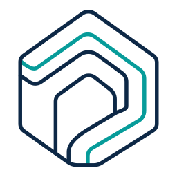

# Toposync



A local-first platform (Python + React + ThreeJS) for a home automation “digital twin” — built on an **extensions runtime**.

This repo’s main goal is to solve the “biggest knot”: **extensions with a Python backend + TypeScript frontend installable via wheel** (without requiring a build toolchain on the user’s machine).

## Documentation

- Install guides: `docs/install/README.md`
- Compatibility: `docs/install/architecture-support.md`
- Legacy/context docs: `docs/old/README.md`
- Running in dev: `docs/old/DEVELOPMENT.md`
- Pipelines (DAG): `docs/old/PIPELINES.md`
- Extensions (runtime): `docs/old/EXTENSIONS_RUNTIME.md`
- TS contract / plugin API: `docs/old/PLUGIN_API.md`
- Creating an extension: `docs/old/EXTENSION_AUTHORING.md`

## Quickstart (dev)

Prerequisites: `uv`, Python 3.11+, and Node 20+.

```bash
uv sync
npm install
npm run build:extensions
npm run dev
```

Open `http://localhost:5173`.
